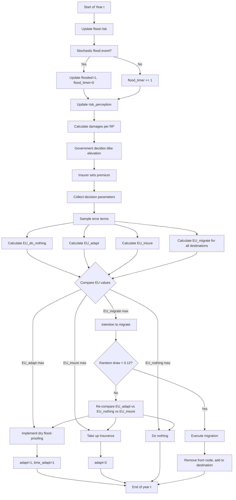
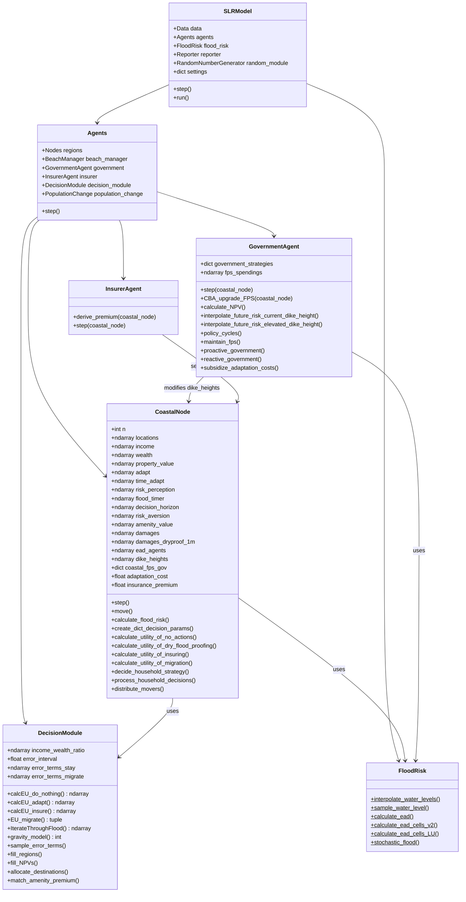
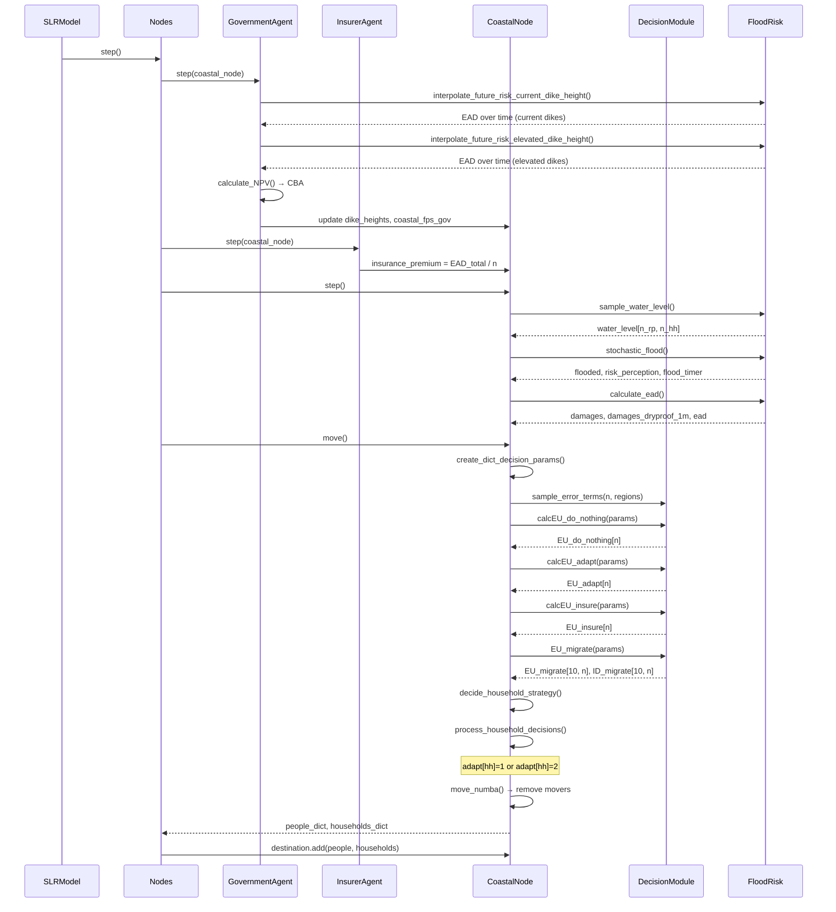

# DYNAMO-M — Household Flood Adaptation & Risk Decisions

## Complete Technical Reference

> **Purpose**: Document every agent decision, formulation, parameter, input, and output
> related to household flood-proofing / risk-adaptation measures in DYNAMO-M, to enable
> coupling with an external flood-damage model.

---

## 1. System Overview

DYNAMO-M is a global agent-based model of coastal household migration and adaptation under
sea-level rise. Each timestep (1 year), coastal households choose among four competing
strategies evaluated via **Subjective Expected Utility (SEU)** theory:

| Strategy | Code Method | Decision Module Function |
|----------|-------------|--------------------------|
| **Do nothing** (status quo) | `CoastalNode.calculate_utility_of_no_actions` | `DecisionModule.calcEU_do_nothing` |
| **Dry flood-proofing** (1 m elevation) | `CoastalNode.calculate_utility_of_dry_flood_proofing` | `DecisionModule.calcEU_adapt` |
| **Flood insurance** | `CoastalNode.calculate_utility_of_insuring` | `DecisionModule.calcEU_insure` |
| **Migration** (to other region) | `CoastalNode.calculate_utility_of_migration` | `DecisionModule.EU_migrate` |

The **government agent** independently decides on **dike elevation** (raising Flood
Protection Standard) via a **Cost-Benefit Analysis (CBA)**.

---

## 2. Decision Flow (Per Timestep)

> **Process step IDs (P0–P6).** The labels below are shared verbatim with
> `input_data_requirements.md` §6 so the data ↔ parameter ↔ code ↔ process chain
> is consistent across both documents. **P0 (Agent Initialization)** runs once at
> model setup (`data.py::Data` loads all inputs; `agents/*` build the agents); the
> remaining steps run every timestep inside `Model.step()`.
>
> **Module locations (verified):** `PopulationChange` and `GDP_change` are
> instantiated by `agents/__init__.py::Agents` as `model.agents.population_change`
> and `model.agents.GDP_change`; `GDP_change` is defined in `GDP_change.py`. Note:
> `agents/__init__.py` imports `PopulationChange` from `population_change.py`, but
> that file currently exposes only helper functions (`WorldPopProspectsChange`,
> `SSP_population_change`) — the `class PopulationChange` appears to be missing and
> should be reconciled in code.

```
┌─ Model.step() ─────────────────────────────────────────────────────────────┐
│                                                                             │
│  1. PopulationChange.step()        (ambient birth/death)        ── [P1]     │
│  2. GDP_change.step()              (income growth)              ── [P2]     │
│  3. Beaches.step()                 (erosion update)             ── [P3]     │
│  4. For each CoastalNode:                                                  │
│     a. GovernmentAgent.step()                                   ── [P4a]    │
│        ├─ maintain_fps / proactive / reactive / no_adaptation              │
│        └─ CBA_upgrade_FPS() — decides dike elevation                       │
│     b. InsurerAgent.step()                                      ── [P4b]    │
│        └─ derive_premium() — sets insurance_premium = EAD_total / n        │
│     c. CoastalNode.step()                                                  │
│        ├─ process_population_change()                                      │
│        ├─ calculate_flood_risk()                                ── [P4c]    │
│        │   ├─ FloodRisk.sample_water_level()  → water_level array          │
│        │   ├─ FloodRisk.stochastic_flood()    → flooded, risk_perception   │
│        │   └─ FloodRisk.calculate_ead()       → damages, damages_dryproof  │
│        ├─ calculate_coastal_amenity_values()                    ── [P4d]    │
│        └─ update_utility_surface()                                         │
│     d. CoastalNode.move()          <─── THE CORE DECISION       ── [P4e]    │
│        ├─ create_dict_decision_params()                                    │
│        ├─ sample_error_terms()                                             │
│        ├─ calcEU_do_nothing()                                              │
│        ├─ calcEU_adapt()           (dry flood-proofing)                     │
│        ├─ calcEU_insure()                                                  │
│        ├─ EU_migrate()                                                     │
│        ├─ distribute_movers()  → decide_household_strategy()               │
│        │   └─ argmax(EU_nothing, EU_adapt, EU_insure, EU_migrate)          │
│        ├─ process_household_decisions()                                    │
│        │   ├─ adapt[hh] = 1  (dry flood-proofing)                          │
│        │   └─ adapt[hh] = 2  (insurance)                                   │
│        └─ move_numba()  → remove movers from arrays                        │
│  5. Parse move dictionaries → destination.add()                 ── [P5]     │
│  (Reporter.step() writes outputs after the loop)               ── [P6]     │
│                                                                             │
└─────────────────────────────────────────────────────────────────────────────┘
```

### Process Step ID Mapping (shared with `input_data_requirements.md` §6)

| Step ID | Process name | Driver method | Primary code file / class |
|---------|--------------|---------------|---------------------------|
| **P0** | Agent Initialization | `Data.__init__` + node/agent loaders | `data.py::Data`, `agents/nodes.py::Nodes`, `agents/coastal_nodes.py::CoastalNode`, `agents/read_agent_data.py` |
| **P1** | Ambient Population Change | `PopulationChange.step()` | `population_change.py::PopulationChange` (`model.agents.population_change`) |
| **P2** | Economic Growth | `GDP_change.step()` | `GDP_change.py::GDP_change` (`model.agents.GDP_change`); SSP/GDP tables loaded in `data.py::Data` |
| **P3** | Shoreline / Erosion Update | `Beaches.step()` | `agents/beaches.py::Beaches`, `agents/beach_manager.py::BeachManager` |
| **P4a** | Government Dike Decision | `GovernmentAgent.step()` / `CBA_upgrade_FPS()` | `agents/government_agent.py::GovernmentAgent` |
| **P4b** | Insurance Premium | `InsurerAgent.step()` / `derive_premium()` | `agents/insurer_agent.py::InsurerAgent` |
| **P4c** | Flood Risk Calculation | `CoastalNode.calculate_flood_risk()` | `hazards/flooding/flood_risk.py::FloodRisk` (`model.flood_risk`), `agents/coastal_nodes.py::CoastalNode` |
| **P4d** | Coastal Amenity Calculation | `CoastalNode.calculate_coastal_amenity_values()` | `agents/coastal_amenities.py::CoastalAmenities` (`model.coastal_amenities`), `agents/coastal_nodes.py::CoastalNode` |
| **P4e** | Household Decision (SEU) | `CoastalNode.move()` | `agents/coastal_nodes.py::CoastalNode`, `decision_module.py::DecisionModule` |
| **P5** | Migration Allocation | `distribute_movers()` / `destination.add()` | `decision_module.py::DecisionModule`, `gravity_models/read_gravity_model.py`, `agents/nodes.py::Nodes` |
| **P6** | Reporting | `Reporter.step()` / `Reporter.report()` | `reporter.py::Reporter` (`model.reporter`) |

---

## 3. Mathematical Formulations

### 3.1 Subjective Expected Utility (SEU) — Core Framework

All household decisions use CRRA (Constant Relative Risk Aversion) utility integrated over perceived flood probabilities using the **trapezoidal rule**.

#### General form (for option X):

```
EU_X = ∫₀¹ U(NPV_X(p)) dp    (numerically via np.trapz)
```

#### 3.1.1 Risk Aversion (σ)
*   **Where defined**: In DYNAMO-M's `settings.yml` under `decisions.risk_aversion` (default is `1`). It is read at runtime or can be passed as an override to the bridge `__init__`.
*   **Formulation**:
    *   If σ = 1 (logarithmic utility):
        `U(c) = ln(c)`
    *   If σ ≠ 1 (CRRA utility):
        `U(c) = (c^(1-σ)) / (1-σ)`
    *   If σ > 1 (high risk aversion), utility drops to -infinity much faster as wealth approaches 0. If σ < 1 (low risk aversion, e.g., 0.5), households are less risk-averse.

#### 3.1.2 NPV calculation (per flood event i):

The Net Present Value (NPV) for a given decision state under a flood event i is calculated using the following formulas:
`NPV_i = (W + Y + A - D_i) + sum_{t=1 to T-1} ((W + Y + A - D_i) / (1 + r)^t)`
`NPV_i = (W + Y + A - D_i) * (1 + sum_{t=1 to T-1} (1 / (1 + r)^t))`

Where:
- `W` = household wealth
- `Y` = household income
- `A` = amenity value (= amenity_premium × wealth × amenity_weight)
- `D_i` = expected damage under flood event i
- `T` = decision horizon (years) — defined in `settings.yml` under `decisions.decision_horizon` (default `15`)
- `r` = time discount rate — defined in `settings.yml` under `decisions.time_discounting` (default `0.032`)

#### 3.1.3 Exceedance Probability vs. Flood Probability
*   **Exceedance Probability (EP)**: The probability that a flood of a given return period (or greater) will occur in any single year. It is mathematically defined as `EP = 1 / Return Period (RP)`. For example, a 100-year flood has an exceedance probability of `1/100 = 0.01`.
*   **Difference with occurrence probability**: While a single occurrence probability refers to a specific flood magnitude, the exceedance probability represents the cumulative probability of experiencing a flood *at least* as severe as that event.
*   **Ex-Ante Curve**: The integration is computed over the cumulative exceedance curve `x in [0, 1]`, where events are sorted by severity from most severe (lowest exceedance probability) to least severe (highest exceedance probability).

#### 3.1.4 Perceived flood probability:
```
p_perceived_i = p_actual_i × risk_perception
```
Capped at 0.998 (max one flood per year in perception).

#### 3.1.5 Numerical Integration Coordinates (0.001 Offset and 0.0005 Area Factor)

To calculate Subjective Expected Utility (SEU), DYNAMO-M integrates a household's utility across the exceedance probability domain `x in [0, 1]` using the trapezoidal method (`np.trapz` in Python).

##### 1. Defining the "Weights"
The expected utility equation can be expressed using weights applied to the utility values of each state:
`Expected Utility = flood_weight * y_flood + no_flood_weight * y_no_flood`
Where:
- `flood_weight = p_perceived + 0.0005`
- `no_flood_weight = 1.0 - p_perceived - 0.0005`
- `y_flood = U(NPV_flood)` (utility under flood conditions)
- `y_no_flood = U(NPV_no_flood)` (utility under normal/no-flood conditions)

*(Note: The term "eight" in user discussions is a common typographical slip for "weight", representing these coefficient formulas. Alternatively, if "eight" refers to the hazard inputs, DYNAMO-M utilizes 8 return periods [2, 5, 10, 25, 50, 100, 250, 500] in its default configuration to partition the probability space).*

##### 2. The 0.001 Offset
A household's utility under threat of flooding is a step function: the household suffers flood damage (utility `y_flood`) for all exceedance probabilities up to `p_perceived`, and experiences no flood damage (utility `y_no_flood`) for exceedance probabilities greater than `p_perceived`. This creates a mathematical discontinuity (a vertical jump) at `x = p_perceived`.

Because the trapezoidal rule (`np.trapz`) requires a continuous function defined at discrete points, it cannot handle an instantaneous vertical step. To model this vertical transition numerically without introducing a sloped transition across a wide probability range, the model inserts a very narrow transition coordinate step of width `delta = 0.001` immediately after `p_perceived`.
This defines the integration coordinates along the probability axis as:
`x = [0, p_perceived, p_perceived + 0.001, 1.0]`
And the corresponding utility coordinates as:
`y = [y_flood, y_flood, y_no_flood, y_no_flood]`

##### 3. The 0.0005 Area Factor (Half of the 0.001 Offset)
Applying the trapezoidal rule `Area = sum(((y_i-1 + y_i) / 2) * delta_x_i)` to the three coordinate intervals:
1. **Interval 1** `[0, p_perceived]`:
   - Width: `p_perceived`
   - Average Height: `y_flood`
   - Area: `p_perceived * y_flood`
2. **Interval 2** `[p_perceived, p_perceived + 0.001]` (The transition step):
   - Width: `0.001`
   - Average Height: `(y_flood + y_no_flood) / 2`
   - Area: `0.001 * (y_flood + y_no_flood) / 2 = 0.0005 * y_flood + 0.0005 * y_no_flood`
3. **Interval 3** `[p_perceived + 0.001, 1.0]`:
   - Width: `1.0 - (p_perceived + 0.001) = 0.999 - p_perceived`
   - Average Height: `y_no_flood`
   - Area: `(0.999 - p_perceived) * y_no_flood`

Summing these three areas:
`Total Area = (p_perceived * y_flood) + (0.0005 * y_flood + 0.0005 * y_no_flood) + (0.999 - p_perceived) * y_no_flood`
`Total Area = (p_perceived + 0.0005) * y_flood + (0.0005 + 0.999 - p_perceived) * y_no_flood`
`Total Area = (p_perceived + 0.0005) * y_flood + (1.0 - p_perceived - 0.0005) * y_no_flood`

Thus, `0.0005` is exactly half of the hard-coded step size `(0.001 / 2)`. It represents the portion of the transition step's area allocated to each utility state by the trapezoidal rule's height averaging.

##### 4. Multi-Event Scaling (n_events ≥ 2)
If there are k sorted events:
- Coordinates: `x = [0, p_perceived_1, p_perceived_2, ..., p_perceived_k, p_perceived_k + 0.001, 1.0]`
- Utilities: `y = [U(NPV_1), U(NPV_1), U(NPV_2), ..., U(NPV_k), U(NPV_no-flood), U(NPV_no-flood)]`
- This partitions the integration space into discrete bands: `[0, p_1]` experiencing `D_1`, `[p_1, p_2]` experiencing `D_2`, up to `[p_k + 0.001, 1.0]` experiencing no flood.


#### 3.1.6 Property Value (Max Potential Damage)
*   **Where defined**: Derived from the FIAT exposure attribute `Max Potential Damage` (structure + content) and passed into the decision bridge as `property_value`.
*   **Importance**: It acts as the key exposure bound in the model. DYNAMO-M enforces two levels of capping to maintain physical consistency and mathematical stability:
    1. **Wealth Capping (Capping Property Value at Wealth)**: Property value is capped at the household's current wealth:
       `property_value = min(max_pot_dmg, W)`
       *   *Physical Rationale*: A household's total wealth represents the sum of their property asset value and liquid savings. Thus, a household cannot own a home whose replacement value exceeds their total wealth. This ensures the agent-based assets remain physically consistent with their economic status.
       *   *Mathematical Rationale (Utility Stability)*: DYNAMO-M uses logarithmic utility `U(c) = ln(c)` or CRRA utility. The argument of the utility function (the Net Present Value, `NPV = 2 * (W + Y - D)`) must be strictly positive. If wealth falls and expected damages (`D`) are allowed to exceed wealth and income, NPV would become negative, causing the utility calculations to fail (e.g. `ln(negative)`). Wealth capping is the first line of defense to keep NPV positive.
    2. **Property Value Capping (Capping Damages at Property Value)**: Expected and realized flood damages (`D_i`) are capped at the property value:
       `D_i = min(D_i, property_value)`
       *   *Physical Rationale*: A flood cannot cause more economic damage to a building than the total replacement value of the building itself (the property value).
       *   *Data Calibration Guard*: When coupling with an external hazard model like FloodAdapt, damage values are interpolated from depth-damage curves. In extreme sea-level-rise scenarios, deep inundation can occasionally produce interpolated damages that exceed the building's asset value in the FIAT exposure table. Capping damages at the property value filters out these anomalies.
    3. **Decision threshold (Old rule)**: Used directly in the denominator of FloodAdapt-ABM's old rule to calculate the damage ratio (`total_damage / max_pot_dmg > 0.3`).

#### 3.1.7 Adaptation Financing (Loans)
Dry flood-proofing is financed by taking an adaptation loan. Rather than paying the entire cost upfront, households pay an annual cost amortized over the loan period:
*   **Amortized Loan Cost Formula**:
    `Annual Loan Cost = total_cost * (r_loan * (1 + r_loan)^L) / ((1 + r_loan)^L - 1)`
*   **Where defined**: Loan duration `L` (default `16` years) and interest rate `r_loan` (default `0.04`) are defined in `settings.yml` under `decisions.adaptation`.

#### 3.1.8 Error Terms (Stochastic Noise)
*   **Where defined**: In `settings.yml` under `decisions.error_interval` (default `0.0`).
*   **Description**: To represent unobserved behavioral factors in household decisions, the bridge samples uniform random noise:
    `epsilon ~ Uniform(1 - error_interval, 1 + error_interval)`
    The final utility values are multiplied by this noise:
    `EU_noisy = EU * epsilon`
    If `error_interval` is `0.0`, the multiplier is always `1.0`, resulting in purely deterministic utility-maximizing choices.

#### 3.1.9 Filtering of Agent Types (Residential vs. Commercial)
*   **Why filter out commercial**: Commercial entities and public infrastructure are included in the FloodAdapt lookup table because FIAT requires them to calculate total economic damage of the community. However, DYNAMO-M's decision engine is specifically designed to simulate **household cognitive and behavioral dynamics** (personal wealth, household income, domestic risk aversion, and residential dry-proofing loans). Since commercial businesses do not make decisions based on domestic utility/loan parameters, they are filtered out from the decision bridge (`is_residential` is set to `False`) and remain on the baseline strategy.

---

### 3.2 EU of Do Nothing (`calcEU_do_nothing`)

```
D_i = damages[i]    (no adaptation applied)
NPV computed as above
EU_do_nothing = ∫₀¹ U(NPV(p)) dp

If already adapted (adapt == 1): EU_do_nothing = -∞
(prevents double-counting; adapted agents cannot "un-adapt")
```

**File**: `decision_module.py:369-471`

---

### 3.3 EU of Dry Flood-Proofing (`calcEU_adapt`)

```
D_i = damages_dryproof_1m[i]    (reduced damages with 1m dry-proofing)

Cost deducted from NPV:
  - Annual adaptation cost = total_cost × [r_loan(1+r_loan)^L / ((1+r_loan)^L - 1)]
  - Time-discounted cost = Σ_{t=0}^{min(loan_left, T)} annual_cost / (1+r)^t
  - loan_left = loan_duration - time_since_adaptation

NPV_adapt_i = NPV_i - time_discounted_adaptation_cost

Affordability constraint:
  If income × expenditure_cap ≤ adaptation_costs → EU_adapt = -∞
```

**File**: `decision_module.py:114-240`

---

### 3.4 EU of Insurance (`calcEU_insure`)

```
D_i = damages[i] × deductible    (default deductible = 10%)

Premium cost deducted from NPV:
  - Time-discounted premium = Σ_{t=0}^{T} mean(premium) / (1+r)^t
  - premium = EAD_total_node / n_households  (set by InsurerAgent)

NPV_insure_i = NPV_i - time_discounted_premium

Affordability constraint:
  If income × expenditure_cap ≤ premium → EU_insure = -∞
```

**File**: `decision_module.py:243-367`

---

### 3.5 EU of Migration (`EU_migrate`)

```
For each candidate destination region j:
  
  Expected_income_j = income_distribution_j[income_percentile]
  Expected_wealth_j = income_wealth_ratio(income_percentile) × Expected_income_j
  Expected_amenity_j = amenity_premium_cell_j × amenity_weight × Expected_wealth_j
  Expected_EAD_j = damage_factor_cell_j × risk_perception

  NPV_j = (Expected_wealth_j + Expected_income_j + Expected_amenity_j - Expected_EAD_j × risk_perception) 
           × Σ_{t=0}^{T-1} 1/(1+r)^t

  Migration_cost_j = Cmax / (1 + exp(-cost_shape × min(distance_j, 5000)))
  
  NPV_j = NPV_j - Migration_cost_j

  EU_j = U(NPV_j)    (CRRA utility)

EU_migrate = max_j(EU_j)  over top-10 destinations
```

**Intention-to-behavior filter**:
```
Only fraction `intention_to_behavior` (default 12%) of households intending to
migrate actually move (random draw).
```

**File**: `decision_module.py:686-832`

---

### 3.6 Strategy Selection (`decide_household_strategy`)

```python
# Household migrates if:
EU_migrate > EU_adapt AND EU_migrate > EU_do_nothing AND EU_migrate > EU_insure

# After intention_to_behavior filter, remaining households:
# Adapt if:
EU_adapt > EU_do_nothing AND EU_adapt ≥ EU_insure AND EU_adapt ≥ EU_migrate

# Insure if:
EU_insure > EU_do_nothing AND EU_insure > EU_adapt AND EU_insure > EU_migrate

# Otherwise: do nothing
```

**File**: `coastal_nodes.py:1888-1939`

---

### 3.7 Risk Perception Dynamics

```
risk_perception = risk_perc_max × base^(risk_decr × flood_timer) + risk_perc_min

Where:
  flood_timer += 1 each year
  flood_timer = 0 when household is flooded (reset)

Default parameters:
  risk_perc_max = 2.0
  risk_perc_min = 0.01
  risk_decr (coef) = -3.6
  base = 1.6 (exponential base)
```

This means risk perception **spikes after a flood** (simulating the availability heuristic, where recent events dominate threat estimation) and **decays exponentially** over time as complacency returns.

#### 3.7.1 Calibration Guidelines for Risk Decay Parameters
When conducting a flood risk ABM analysis, these parameters should be calibrated using:
1. **Empirical Survey Data**: Household surveys can track how quickly flood insurance or floodproofing adoption drops off after a major flood. For example, if insurance drop-off shows a half-life of 3 years, the decay rate should be calibrated to match.
2. **Psychological Studies**: The `risk_perc_max` parameter represents how much households overestimate the actual probability of a flood right after experiencing it. The default of `2.0` (doubling of perceived risk) aligns with behavioral economics findings on availability bias. In highly risk-aware or coastal-adapted communities, this multiplier can be calibrated higher.
3. **Parameter Scenarios**:
   - **Complacent Community (Fast Decay)**: Set a more negative `coef` (e.g., `-5.0`) or lower `base` (e.g., `1.2`) to simulate memory disappearing within 2-3 years.
   - **Persistent Risk Memory (Slow Decay)**: Set `coef` closer to 0 (e.g., `-1.0`) to represent memory that persists for over 10-15 years (often seen in communities that suffered extreme historical disasters like Hurricane Katrina).

**File**: `hazards/flooding/flood_risk.py:644-646`

---

### 3.8 Government Dike Decision (CBA)

```
NPV_dike = Σ_{t=0}^{T_gov} (EAD_current - EAD_elevated) / (1+r_gov)^t 
           - Construction_cost - ΔMaintenance_cost

Construction_cost = Σ(dike_elevation_m × cost_per_m_km × dike_length_km)
ΔMaintenance = (new_length - old_length) × maintenance_cost_per_km

Decision rule:
  If NPV_raise > 0 AND NPV_raise > NPV_maintain → raise FPS one level
  Elif NPV_maintain > 0 → maintain current FPS
  Else → only pay maintenance

Strategies:
  maintain_fps:       Always raise dikes to maintain initial FPS (no CBA)
  proactive_government: CBA every 6 years or after flood
  reactive_government:  CBA only after flood event
  no_adaptation:        No government action
  no_government:        No government action
```

**File**: `agents/government_agent.py:395-520`

---

### 3.9 Adaptation Lifespan and Re-decision

```
When time_adapt reaches lifespan_dryproof (default 75 years):
  adapt = 0
  time_adapt = 0
→ Household must decide again next timestep
```

**Sequential Adaptation**: Households can adapt multiple times (i.e. elevate their house again) but **only sequentially**, not cumulatively. While an adaptation is active (`adapt == 1`), `EU_do_nothing` is set to `-∞` and the household cannot stack another elevation. Only after the lifespan expires and the status resets to `0` can the household re-evaluate and potentially choose to elevate again (if it remains the highest affordable utility).

**File**: `coastal_nodes.py:2208-2212`

---

### 3.10 Flood Hazard Interpolation and Dike Overtopping

During each simulation timestep (representing a single year), water levels per return period are retrieved, and dike failures due to overtopping or insufficient protection standards are processed.

* **Class/Function**: [FloodRisk.sample_water_level()](file:///C:/repos/DYNAMO-M/DYNAMO-M/hazards/flooding/flood_risk.py#L159-L291) in `hazards/flooding/flood_risk.py`.
* **Formulation & Process**:
  1. Retrieve the pre-calculated water levels *W_Y* at the current timestep (where *Y* = current_year and the timestep index is `current_year - start_year`) for each return period *rt*.
  2. For a given household in a government region with dike protection standard *FPS_gov*:
     - If the return period is less than the protection standard (*rt* < *FPS_gov*), the dike blocks the flood and the household experiences zero flood depth:
       `W_effective = 0`
     - If the return period meets or exceeds the protection standard (*rt* ≥ *FPS_gov*), the dike fails/is overtopped, and the household experiences the full interpolated water level:
       `W_effective = W_Y`
  3. **Overtopping Failure and FPS Decay**:
     Even if *rt* < *FPS_gov*, a dike can fail if local water levels along the coast exceed the dike heights. The model checks dike heights *H_dike* against water levels at coastal dike cells:
     - The number of overtopped cells is:
       `N_overtopped = sum(H_dike + 0.01 < W_coastal)`
     - If `N_overtopped ≥ 1` (threshold is set to 0% in code), the dike is overtopped.
     - When overtopped, the government's protection standard decays to the current flood's return period:
       `FPS_gov = rt`
     - Households in the region then experience the full interpolated water level:
       `W_effective = W_Y`

* **Dike Heights Origin**:
  - **Initialization**: Dike heights (`self.dike_heights`) are initialized during model setup in `agents/coastal_nodes.py` (lines 311–345). The initial regional FPS is determined by the median FLOPROS values of coastal cells adjacent to dikes. Dike heights are then set to the baseline water level corresponding to this initial FPS at timestep 0 (simulation start year).
  - **Dynamic Changes**: Government agents can dynamically elevate dikes in `GovernmentAgent.step()` (or `CBA_upgrade_FPS()`) if the cost-benefit analysis yields a positive net present value (NPV) for upgrading the protection standard.

* **Erosion Toggle Independence**:
  - The dike overtopping check and standard degradation logic are **always active** for all coastal regions containing dikes.
  - While `FloodRisk.sample_water_level()` accepts beach width and erosion arguments (`beach_width_floodplain`, `beach_mask`, `erosion_effect_fps`), **these variables are unused inside the function**. Dike failure and degradation logic run unconditionally, regardless of whether erosion is enabled (`include_erosion`) in `settings.yml`.

* **Dike Overtopping Thresholds**:
  - **Inundation Check**: A **0% threshold** is used in `FloodRisk.sample_water_level()` (i.e. if at least 1 cell is overtopped, the dike standard fails and decays).
  - **Government Planning**: A **10% threshold** is used by the government agent in `get_timesteps_overtopping_numba` inside `agents/government_agent.py` to project future overtopping years for Cost-Benefit Analysis (CBA).

* **Concrete Example (2016 flood, RCP 4.5, 250-year return period)**:
  For a simulation in the year 2016:
  - The pre-calculated interpolated 250-year water level *W_2016* is `1.66 m` (see [input_data_requirements.md](file:///C:/repos/DYNAMO-M/docs/input_data_requirements.md#L156-L162)).
  - **Case A (Protected region, *FPS_gov* = 500)**:
    Since *rt* = 250 < 500, the dike successfully blocks the flood. If no overtopping occurs along the coast, the effective water level is:
    `W_effective = 0 m`
  - **Case B (Unprotected/failing region, *FPS_gov* = 250)**:
    Since *rt* = 250 ≥ 250, the protection standard is exceeded. The household experiences the full interpolated flood depth:
    `W_effective = 1.66 m`
  - **Case C (Dike overtopping, *FPS_gov* = 500 but dike height exceeded)**:
    Even though *rt* = 250 < 500, if the coastal water level for the 250-year event exceeds the local dike height *H_dike* plus the safety margin of `0.01 m`, the dike is overtopped (`N_overtopped ≥ 1`).
    The government standard decays:
    `FPS_gov = 250`
    And the household experiences the full flood depth:
    `W_effective = 1.66 m`

* **Tracking in Model Outputs**:
  - **Dike upgrading decisions** and elevations are written to the `government.log` file.
  - **Regional flood return periods** are tracked in the `flood_tracker.csv` output file.
  - **Uptake of dry-proofing** as a response to flooding is logged in the `percentage_adapted.csv` and `n_households_adapted.csv` output files.

**File**: `hazards/flooding/flood_risk.py:159-291`

---

## 4. Complete Parameter Table

### 4.1 Household Decision Parameters (from `settings.yml`)

| Parameter | Settings Path | Default | Unit | Description |
|-----------|--------------|---------|------|-------------|
| `risk_aversion` (σ) | `decisions.risk_aversion` | 1 | dimensionless | CRRA coefficient (1 = log utility) |
| `decision_horizon` (T) | `decisions.decision_horizon` | 15 | years | Planning horizon for NPV |
| `time_discounting` (r) | `decisions.time_discounting` | 0.032 | fraction/year | Discount rate |
| `error_interval` | `decisions.error_interval` | 0.0 | fraction | Uniform noise ±X on EU values |
| `expenditure_cap` | `adaptation.expenditure_cap` | 0.06 | fraction of income | Max fraction of income for adaptation/insurance |
| `loan_duration` | `adaptation.loan_duration` | 16 | years | Repayment period |
| `interest_rate` | `adaptation.interest_rate` | 0.04 | fraction/year | Loan interest rate |
| `lifespan_dryproof` | `adaptation.lifespan_dryproof` | 75 | years | Dry-proofing measure lifetime |
| `intention_to_behavior` | `decisions.migration.intention_to_behavior` | 0.12 | fraction | Share of migration intenders that actually move |
| `cost_shape` | `decisions.migration.cost_shape` | 0.05 | km⁻¹ | Logistic migration cost shape parameter |
| `amenity_weight` | `decisions.migration.amenity_weight` | 1 | dimensionless | Weight of amenity in utility calculations |
| `limit_admin_growth` | `decisions.migration.limit_admin_growth` | true | boolean | Cap in-migration per region |
| `max_admin_growth` | `decisions.migration.max_admin_growth` | 0.1 | fraction | Max growth of receiving region per step |
| `nr_cells_to_assess` | `decisions.migration.nr_cells_to_assess` | 5 | count | Cells evaluated for allocation |

### 4.2 Risk Perception Parameters

| Parameter | Settings Path | Default | Unit | Description |
|-----------|--------------|---------|------|-------------|
| `risk_perc_base` | `flood_risk_calculations.risk_perception.base` | 1.6 | dimensionless | Exponential base |
| `risk_perc_min` | `flood_risk_calculations.risk_perception.min` | 0.01 | dimensionless | Minimum risk perception |
| `risk_perc_max` | `flood_risk_calculations.risk_perception.max` | 2.0 | dimensionless | Maximum risk perception (post-flood) |
| `risk_perc_coef` | `flood_risk_calculations.risk_perception.coef` | -3.6 | dimensionless | Decay coefficient |

### 4.3 Flood Protection & Government Parameters

| Parameter | Settings Path | Default | Unit | Description |
|-----------|--------------|---------|------|-------------|
| `flood_protection_standard` | `flood_risk_calculations.flood_protection_standard` | FLOPROS | return period (yr) | Initial FPS from FLOPROS database |
| `government_strategy` | `adaptation.government_strategy` | maintain_fps | enum | Dike decision strategy |
| `government_discount_rate` | hardcoded in `CBA_upgrade_FPS` | 0.04 | fraction/year | Gov NPV discount rate |
| `government_decision_horizon` | hardcoded in `CBA_upgrade_FPS` | 100 | years | Gov planning horizon |
| `policy_cycle_interval` | hardcoded in `policy_cycles` | 6 | years | Proactive reassessment interval |
| `dike_overtopping_threshold` | hardcoded in code | 0.1 (gov) / 0 (flood) | fraction | Cells overtopped to lose FPS |

### 4.4 Insurance Parameters

| Parameter | Source | Default | Unit | Description |
|-----------|--------|---------|------|-------------|
| `include_insurance` | `agent_behavior.include_insurance` | false | boolean | Toggle insurance module |
| `deductible` | hardcoded in `calcEU_insure` | 0.1 | fraction | Household pays 10% of damage |
| `premium` | `InsurerAgent.derive_premium` | EAD_total/n | USD/year | Community-rated premium |

### 4.5 Income-Wealth Mapping

| Income percentile | 0 | 20 | 40 | 60 | 80 | 100 |
|---|---|---|---|---|---|---|
| Wealth/Income ratio | 0 | 1.06 | 4.14 | 4.19 | 5.24 | 6.0 |

Linearly interpolated for intermediate percentiles.

---

## 5. Input Variables (per household)

| Variable | Array Name | Type | Source | Description |
|----------|-----------|------|--------|-------------|
| Household income | `income` | int32 | Income distribution × percentile | Annual income (USD PPP) |
| Income percentile | `income_percentile` | int16 | Initialization / sampling | Position in income distribution |
| Household wealth | `wealth` | int32 | income × wealth_ratio(percentile) | Total wealth |
| Property value | `property_value` | int32 | max_damage_residential_object (capped at wealth) | Exposure value |
| Adaptation status | `adapt` | int8 | 0=none, 1=dry-proofed, 2=insured | Current strategy |
| Time since adaptation | `time_adapt` | int16 | Counter | Years since dry-proofing |
| Risk perception | `risk_perception` | float32 | Dynamics (flood_timer) | Subjective probability multiplier |
| Flood timer | `flood_timer` | int16 | Reset on flood | Years since last flood |
| Decision horizon | `decision_horizon` | int8 | settings | T parameter |
| Risk aversion | `risk_aversion` | float32 | settings | σ parameter |
| Amenity value | `amenity_value` | int32 | amenity_premium × wealth | Location amenity |
| Coastal amenity premium | `coastal_amenity_premium` | float | Distance-to-coast function | Premium factor [0,1) |
| Flooded status | `flooded` | int8 | Stochastic model | 1 if flooded this year |
| EAD (no adapt) | `ead` | float32 | FloodRisk.calculate_ead | Expected annual damage |
| EAD (dry-proofed) | `ead_dryproof` | float32 | FloodRisk.calculate_ead | EAD with 1m dry-proofing |
| Damages per RP | `damages` | float32[n_rp, n] | FloodRisk | Damage per return period |
| Damages dryproof per RP | `damages_dryproof_1m` | float32[n_rp, n] | FloodRisk | Damage with dry-proofing per RP |
| Location | `locations` | float32[n, 2] | lon, lat | Spatial position |
| Cell index | `indice_cell_agent` | int32 | Mapping to admin grid | Grid cell of agent |
| Adaptation cost | `adaptation_costs` | int32 | Country-scaled | Annual repayment |
| Insurance premium | `insurance_premium` | float | InsurerAgent | Annual premium |

---

## 6. Output Variables (per household / per node)

| Variable | Level | Type | Description |
|----------|-------|------|-------------|
| `adapt` | household | int8 | 0/1/2 = none/dry-proofed/insured |
| `time_adapt` | household | int16 | Years since implementation |
| `n_households_adapted` | node | int | Count adapted households |
| `percentage_insured` | node | float | % insured |
| `n_households_insured` | node | int | Count insured |
| `annual_summed_adaptation_costs` | node | float | Total adaptation expenditure |
| `household_spendings` | node | float | New dry-proofing investment this step |
| `household_spendings_relative_to_gdp` | node | float | Ratio to national GDP |
| `fraction_intending_to_migrate` | node | float | Share wanting to move |
| `n_intending_to_migrate` | node | int | Count migration-intending |
| `n_moved_out_last_timestep` | node | int | Households that migrated |
| `people_moved_out_last_timestep` | node | int | People that migrated |
| `n_households_that_would_have_moved` | node | int | Would move without adaptation option |
| `n_people_that_would_have_moved` | node | int | People would move without adaptation |
| `ead_total` | node | float | Total EAD (residential+commercial+industrial) |
| `ead_residential` | node | float | Residential EAD |
| `ead_agents` | household | float | Per-household EAD |
| `flood_tracker` | node | int | Return period of last simulated flood |
| `fps_spendings` | government | float | Government dike spending |
| `fps_spendings_relative_to_gdp` | government | float | Ratio to GDP |
| `dike_heights` | node (cells) | float32[] | Current dike elevation |
| `coastal_fps_gov` | node (gov regions) | dict | FPS per government sub-region |

---

## 7. Flood Damage Interface (External Coupling Points)

> [!IMPORTANT]
> **Bidirectional Coupling Context**:
> * **Reverse Coupling (DYNAMO-M as parent)**: As shown in the tables below, DYNAMO-M can ingest external water levels or damages directly, which bypasses its internal GLOFRIS-based interpolation and dike overtopping standard calculations.
> * **Forward Coupling (FloodAdapt-ABM as parent)**: When DYNAMO-M's SEU is ported as a decision engine inside `FloodAdapt-ABM` (see [coupling_architecture.md](file:///C:/repos/FloodAdapt-ABM/docs/coupling_architecture.md) — the authoritative copy now lives in the FloodAdapt-ABM repo), DYNAMO-M's physics module (including its map loading, linear interpolation, and dike overtopping checks) is **entirely bypassed**. Flood depths and building damages are read directly from the FloodAdapt NetCDF lookup table, which are simulated by SFINCS and FIAT.

### 7.1 What DYNAMO-M Needs FROM an External Flood Model

| Input | Current Source | Shape | Description |
|-------|---------------|-------|-------------|
| `water_levels_admin_cells` | Interpolated from GLOFRIS inundation maps | `(n_return_periods, n_cells, n_years)` float32 | Inundation depth per cell, RP, year |
| `dam_func` | Lookup table (601 entries, 0-600cm) | `float32[601]` | Damage fraction = f(water_level_cm) |
| `dam_func_dryproof_1m` | Lookup table | `float32[601]` | Damage fraction with 1m dry-proofing |
| `property_value` | Max damage data (per country) | `float32` per household | Monetary exposure |
| `return_periods` | Config/data | `int[]` e.g. [2,5,10,25,50,100,250,500,1000] | Available RPs |

### 7.2 What DYNAMO-M Provides TO an External Model

| Output | Access Path | Shape | Description |
|--------|------------|-------|-------------|
| Household locations | `coastal_node.locations[:n]` | `(n, 2)` float32 | lon, lat per household |
| Adaptation status | `coastal_node.adapt[:n]` | `(n,)` int8 | 0/1/2 |
| Property value | `coastal_node.property_value[:n]` | `(n,)` int32 | USD |
| Household size | `coastal_node.size[:n]` | `(n,)` int8 | People per HH |
| Income | `coastal_node.income[:n]` | `(n,)` int32 | USD/year |
| Wealth | `coastal_node.wealth[:n]` | `(n,)` int32 | USD |
| Grid cell index | `coastal_node.indice_cell_agent[:n]` | `(n,)` int32 | Index in admin grid |
| Risk perception | `coastal_node.risk_perception[:n]` | `(n,)` float32 | Multiplier |
| Dike heights | `coastal_node.dike_heights` | `(n_dike_cells,)` float32 | Meters |
| FPS per gov region | `coastal_node.coastal_fps_gov` | dict{int: int} | Return period |

### 7.3 Minimal Coupling Interface (Pseudocode)

```python
def couple_external_flood_model(dynamo_model, external_flood_model):
    """
    Replace DYNAMO-M's internal flood damage calculation with external model.
    
    Called ONCE per timestep, BEFORE CoastalNode.move().
    """
    for coastal_node in dynamo_model.agents.regions.all_households:
        if not coastal_node.geom_id.endswith('flood_plain'):
            continue
        
        # 1. Provide household state TO external model
        household_state = {
            'locations': coastal_node.locations[:coastal_node.n],
            'adapt': coastal_node.adapt[:coastal_node.n],           # 0=none,1=dryproof,2=insured
            'property_value': coastal_node.property_value[:coastal_node.n],
            'cell_index': coastal_node.indice_cell_agent[:coastal_node.n],
            'dike_heights': coastal_node.dike_heights,
            'coastal_fps_gov': coastal_node.coastal_fps_gov,
        }
        
        # 2. Get damages FROM external model
        # Expected shape: (n_return_periods, n_households) for each damage scenario
        external_damages = external_flood_model.compute_damages(
            household_state,
            return_periods=np.array([2, 5, 10, 25, 50, 100, 250, 500, 1000])
        )
        
        # 3. Inject into DYNAMO-M arrays
        coastal_node.damages = external_damages['damages_no_adapt']          # shape (n_rp, n)
        coastal_node.damages_dryproof_1m = external_damages['damages_adapted']  # shape (n_rp, n)
        
        # 4. Update derived quantities
        p_floods = 1 / return_periods
        coastal_node.ead_agents = np.trapz(coastal_node.damages, p_floods, axis=0)
        coastal_node.ead_agents[coastal_node.adapt == 1] = np.trapz(
            coastal_node.damages_dryproof_1m[:, coastal_node.adapt == 1], p_floods, axis=0)
```

---

## 8. Mermaid Diagrams

### 8.1 Decision Flowchart



### 8.2 UML Class Diagram



### 8.3 Sequence Diagram (One Timestep, One Node)



---

## 9. Data Flow Summary for Coupling

```
┌─────────────────────────────────────────────────────────────────┐
│                    EXTERNAL FLOOD MODEL                          │
│                                                                  │
│  Inputs needed:                                                  │
│    • Household locations (lon, lat)                              │
│    • Household adapt status (0/1/2)                             │
│    • Property values                                             │
│    • Dike heights per cell                                       │
│    • Return periods to evaluate                                  │
│    • Sea-level rise scenario                                     │
│                                                                  │
│  Outputs provided:                                               │
│    • damages[n_rp, n_hh] — without adaptation                   │
│    • damages_dryproof_1m[n_rp, n_hh] — with dry-proofing        │
│    • (optional) water_levels_admin_cells[n_rp, n_cells, n_years] │
└───────────────────────────┬─────────────────────────────────────┘
                            │
                            ▼
┌─────────────────────────────────────────────────────────────────┐
│                       DYNAMO-M                                   │
│                                                                  │
│  Consumes:                                                       │
│    • coastal_node.damages = ...                                  │
│    • coastal_node.damages_dryproof_1m = ...                      │
│                                                                  │
│  Produces (for next coupling step):                              │
│    • Updated adapt[n] (who adopted dry-proofing)                │
│    • Updated locations (who migrated)                            │
│    • Updated dike_heights (government raised dikes)              │
│    • Updated coastal_fps_gov (new protection standard)           │
│    • Updated income, wealth (economic growth)                    │
│    • n_households_adapted, household_spendings, ...              │
└─────────────────────────────────────────────────────────────────┘
```

---

## 10. Key Code File Reference

| File | Responsibility |
|------|---------------|
| `decision_module.py` | All EU calculations (adapt, insure, migrate, do nothing) |
| `agents/coastal_nodes.py` | Household lifecycle, `move()`, `step()`, decision orchestration |
| `agents/government_agent.py` | Dike CBA, FPS management, government strategies |
| `agents/insurer_agent.py` | Premium derivation (EAD/n) |
| `hazards/flooding/flood_risk.py` | Water levels, EAD calculation, stochastic floods, risk perception |
| `model.py` | Model orchestration, timestep loop |
| `settings.yml` | All behavioral parameters |
| `agents/nodes.py` | Node creation, per-step orchestration over all regions |

---

## 11. Glossary

| Term | Meaning |
|------|---------|
| **FPS** | Flood Protection Standard (return period in years) |
| **EAD** | Expected Annual Damage |
| **SEU** | Subjective Expected Utility |
| **CRRA** | Constant Relative Risk Aversion utility function |
| **NPV** | Net Present Value |
| **Dry flood-proofing** | Elevating household 1m above ground to reduce damages |
| **FLOPROS** | FLOod PROtection Standards database |
| **Amenity premium** | Location value premium (function of distance to coast) |
| **Intention-to-behavior** | Fraction of migration-intending households that actually move |
| **Flood timer** | Years since last flood experience (drives risk perception decay) |

---

## 12. FloodAdapt-ABM Coupling Bridge (MVP Implementation)

An MVP coupling has been developed in **`C:\repos\FloodAdapt-ABM`** to integrate this Subjective Expected Utility (SEU) household decision framework as the decision engine inside the FloodAdapt-ABM simulator.

### 12.1 Configuration Paradigm: Python `@dataclass`
The coupling parameters are defined programmatically using strongly-typed Python `@dataclass` classes in [`coupling_config.py`](file:///C:/repos/FloodAdapt-ABM/coupling_config.py):
- `NetCDFMappingConfig`: Maps logical dimensions and variable names to the NetCDF dataset structure.
- `DecisionConfig`: Contains all SEU parameters with default values matching the calibrated DYNAMO-M `settings.yml` (e.g., risk aversion \(\sigma = 1.5\), loan interest rate \(r_{\text{loan}} = 0.03\)).
- `CouplingConfig`: Composite config container including the random seed.

### 12.2 Bridge Implementation
The core decision logic is implemented in [`dynamo_decision_bridge.py`](file:///C:/repos/FloodAdapt-ABM/dynamo_decision_bridge.py) which contains the class `DynamoDecisionBridge`.
This class imports no DYNAMO-M dependencies directly, keeping the simulator lightweight. Instead, it ports the mathematical functions `_calc_eu_do_nothing`, `_calc_eu_adapt`, and the exponential risk perception decay formula into a self-contained NumPy-based implementation.

### 12.3 Scientific Reference
The underlying mathematical model, risk perception decay, and Subjective Expected Utility equations are based on:

> Tierolf, L., Haer, T., Botzen, W. J. W., de Bruijn, J. A., Ton, M. J., Reimann, L., & Aerts, J. C. J. H. (2023). A coupled agent-based model for France for simulating adaptation and migration decisions under future coastal flood risk. *Scientific Reports, 13*(1), 4176. https://doi.org/10.1038/s41598-023-31351-y

### 12.4 Bridge Implementation Notes

#### Income, Wealth, and Amenity as Separate Inputs
The utility function evaluates total welfare as `U(W + Y + A - D)` where W=wealth, Y=income, A=amenity value, D=expected damages. These are separate inputs because they play different economic roles.

#### Why Re-implement Instead of Import
The decision bridge reimplements rather than importing DYNAMO-M functions because:
- `DecisionModule.__init__` requires live `agents` and `model` objects.
- Module-level import pulls in `gravity_models` infrastructure.
- Instance methods depend on `self.error_terms_stay` populated by model RNG.
- `IterateThroughFlood` relies on Numba.
- Our port is a faithful numpy-only reimplementation that produces identical results without external dependencies.

#### Ex-ante vs. Ex-post Damage Evaluation
The simulation distinguishes between two fundamentally different uses of the event catalog:

| Concept | Purpose | Which Events? | When? |
|---------|---------|---------------|-------|
| **Ex-post Realized Damage** | Physical: what actually hits the agent | Only the 0–3 events stochastically drawn this year | During the year loop |
| **Ex-ante Expected Utility** | Cognitive: how the agent perceives their future risk to make a decision | ALL events in the probability distribution | At the decision moment |

---

*Document revised 2026-06-26. Updated to include MVP coupling bridge implementation details.*
