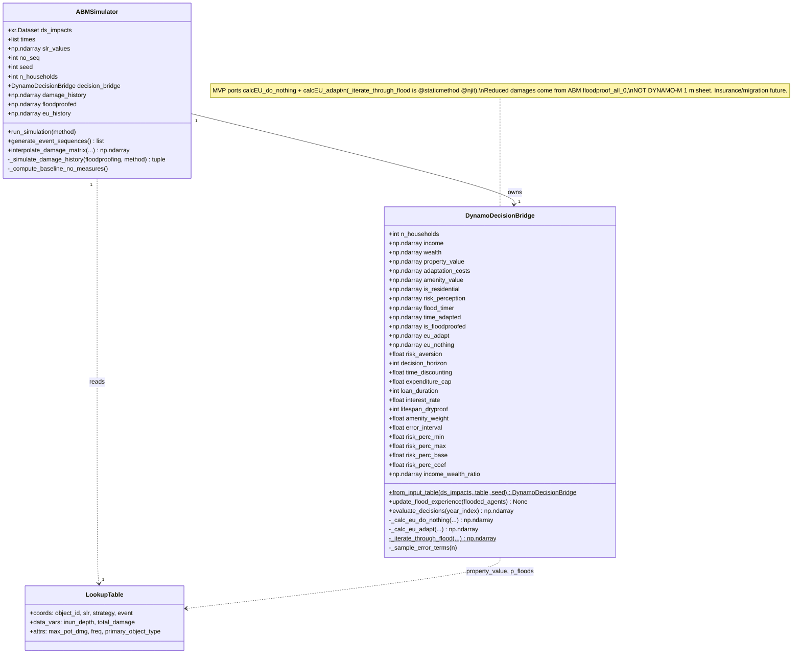
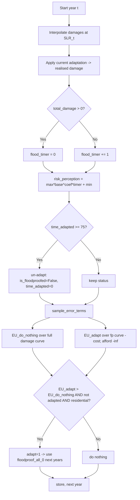
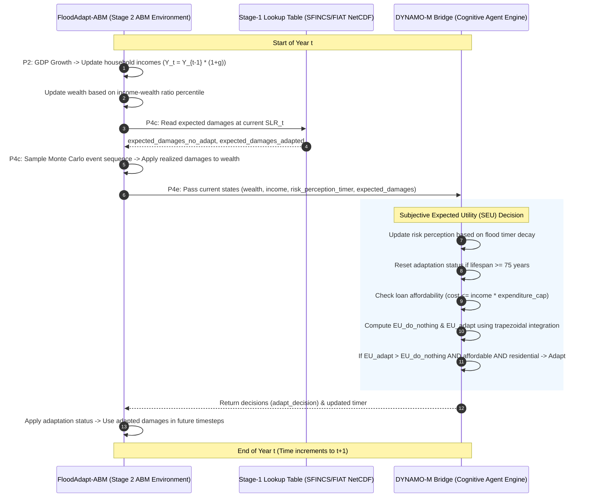

# FloodAdapt-ABM ↔ DYNAMO-M Coupling Architecture

> **Companion doc:** for the consolidated development history, phase-by-phase
> progress, roadmap and day-by-day traceability, see
> [`20260709_proposed_architecture_all_phases.md`](20260709_proposed_architecture_all_phases.md).
> This file is the deep architecture + SEU-math reference; that file is the
> canonical progress/roadmap record. They are kept in lock-step.

> **Revision 2026-07-09.** Relocated into the FloodAdapt-ABM repository (`docs/`) and
> updated to reflect the completed, gated implementation through Phase 4b and the PRE.2
> real-table gate: `floodadapt_abm/coupling_config.py` (Python `@dataclass` configuration),
> `floodadapt_abm/_core/dynamo_decision_bridge.py` (ported SEU bridge + per-SLR interpolation
> cache), `floodadapt_abm/_core/lookup_utils.py` (interpolation kernel),
> `floodadapt_abm/simulation_engine.py` (`run(n_jobs=N)` parallel Monte-Carlo sequences),
> the numbered `examples_engine/` learning path, and the full `tests/` suite (**125 tests —
> all pass**). This version folds in the full review previously
> kept in `coupling_architecture_suggestions.md` (now archived under `docs/archive/`).
> It is reconciled against the updated DYNAMO-M docs `adaptation_decisions_complete.md`
> and `input_data_requirements.md` (shared **P0–P6** process-step IDs), and the
> FloodAdapt-ABM source (`abm_simulator.py`, `setup_lookup_table.py`).

## Minimum Viable Product (MVP) Scope

> [!IMPORTANT]
> The **MVP** replaces the simple rule-based adaptation logic in FloodAdapt-ABM
> (`If building flooded with damage ratio > 0.3 → floodproof`) with DYNAMO-M's
> **Subjective Expected Utility (SEU)** household decision framework, while
> **keeping FloodAdapt-ABM's own household-elevation assumption** (damages of an
> adapted household are read from the `floodproof_all_0` strategy in the lookup
> table — see §1).

> [!NOTE]
> **Overruling of DYNAMO-M's Internal Hazard and Dike Mechanics**:
> When DYNAMO-M's decision module is integrated into FloodAdapt-ABM, DYNAMO-M's internal water level interpolation (`interpolate_water_levels`) and dike overtopping checks (`sample_water_level`) are **completely bypassed**. 
> Instead, all physical flood depths and building damages are dictated by FloodAdapt's SFINCS (hydrodynamic) and FIAT (damage) models, which are pre-computed in the lookup table. Consequently, the DYNAMO-M overtopping checks (such as the 0% cell failure threshold) and GLOFRIS/Aqueduct map scaling do not run, as these physics are already captured by the SFINCS/FIAT runs.

### MVP Scope Definition (traceable to DYNAMO-M P-steps)

| Aspect | MVP (Current) | DYNAMO-M P-step | Future Extension |
|--------|--------------|-----------------|------------------|
| **Agent types** | Households (= residential buildings) only | P4e | Government agent (dike CBA) |
| **Decisions included** | Dry flood-proofing (elevate) OR do nothing | P4e | Insurance, migration |
| **Floodproofing height** | **FloodAdapt-ABM** fixed height (`floodproof_all_0`, set at lookup creation) | — | Variable height per household |
| **Damage source** | FloodAdapt-ABM lookup table (replaces DYNAMO-M `FloodRisk.calculate_ead`) | replaces P4c | Same |
| **Migration** | ❌ Excluded | P4e/P5 | ✅ Full migration + gravity model |
| **Insurance** | ❌ Excluded | P4b/P4e | ✅ `calcEU_insure()` + insurer agent |
| **Government agent** | ❌ Excluded | P4a | ✅ Dike CBA, FPS maintenance |
| **Population / GDP growth** | ❌ Excluded | P1/P2 | ✅ income/wealth dynamics |
| **Risk perception dynamics** | ✅ Exponential decay after flood | P4c | Same |
| **SEU framework** | ✅ `calcEU_do_nothing()` + `calcEU_adapt()` | P4e | Add `calcEU_insure()` + `EU_migrate()` |
| **Adaptation lifespan** | ✅ Enforced (`lifespan_dryproof` = 75 y, see §3.4) | P4e/§3.9 | Same |
| **Affordability constraint** | ✅ Enforced inside `calcEU_adapt` (`expenditure_cap`) | P4e | Same |

### Possible Extensions Beyond MVP

1. **Insurance** — add `calcEU_insure()`; requires an `InsurerAgent` that derives a community-rated premium (`premium = EAD_total / n_households`). Decision becomes argmax over three options.
2. **Migration** — add `EU_migrate()` with destination evaluation, gravity model, and the intention-to-behaviour filter (12%). Requires cross-region population tracking.
3. **Government agent** — add `GovernmentAgent` with CBA-based dike-elevation decisions; requires multi-year water-level projections.

### Terminology

Throughout this document **"household" = one `object_id` row in the lookup
table = one residential building**. Non-residential FIAT objects are excluded
from the SEU decision (see §2.5).

---

## 1. What Gets Replaced in FloodAdapt-ABM

### 1.1 Current Simple Rule (to be replaced)

**File**: `abm_simulator.py`, method `_simulate_damage_history()` — the
vectorized floodproofing decision block at the end of the per-year loop:

```python
# CURRENT LOGIC — simple threshold rule
not_floodproofed = ~is_floodproofed
with_pot_dmg = self.max_pot_dmg > 0
threshold_exceeded = np.zeros(self.n_households, dtype=bool)
valid = not_floodproofed & with_pot_dmg
threshold_exceeded[valid] = (
    total_damage[valid] / self.max_pot_dmg[valid]
) > self.damage_threshold      # self.damage_threshold = 0.3
is_floodproofed = is_floodproofed | threshold_exceeded
```

**What this does**: after the realised damage of year `t`, each non-adapted
household floodproofs iff `total_damage / max_pot_dmg > 0.3`. It is
deterministic, one-shot, reactive, and has no economic reasoning.

### 1.2 What we KEEP from FloodAdapt-ABM

- **The household-elevation assumption.** Once a household is floodproofed,
  damages are read from the **`floodproof_all_0`** strategy in the lookup table
  (a fixed elevation height defined at lookup-table creation). DYNAMO-M's own
  "1 m dry-proofing" assumption is **not** imported — see §3.6.
- The lookup-table interpolation mechanism (`interpolate_damage_matrix()`).
- The Monte-Carlo event-sequence generation (`generate_event_sequences()`).
- The overall simulation loop in `_simulate_damage_history()` (baseline +
  adaptive passes via `run_simulation()`).
- All plotting (`plot_event_damage_timeseries`, `plot_total_damage_statistics`).

### 1.3 HARD REQUIREMENT on the lookup table (exceedance semantics)

DYNAMO-M's SEU integrates utility over an **exceedance-probability curve**
`p = 1 / return_period`, sorted ascending, integrated on `[0, 1]` via
`np.trapz` (see §4.1). FloodAdapt-ABM stores `ds.event.attrs["freq"]` as
**events/year**. For `p_floods = freq` to be a valid exceedance curve, the
**stage-1 lookup table MUST be built from an `EventSet` whose sub-events are a
true return-period set** — DYNAMO-M's canonical RPs are
`[2, 5, 10, 25, 50, 100, 250, 500, 1000]` years
(`input_data_requirements.md` §3.1, §7.1).

> If a non-RP `EventSet` must be used, derive a per-household exceedance curve
> by sorting events on each household's damage before calling the bridge. This
> is heavier and is **not** the MVP path.

---

## 2. What Gets Used from DYNAMO-M

### 2.1 Functions Required (MVP)

> Referenced by **name** (not line number) to stay robust across DYNAMO-M revisions.

| Function | Source | Purpose in coupling |
|----------|--------|---------------------|
| `DecisionModule.calcEU_do_nothing()` | `decision_module.py` | SEU of status quo (no adaptation) |
| `DecisionModule.calcEU_adapt()` | `decision_module.py` | SEU of dry flood-proofing (cost + affordability built in) |
| `DecisionModule.IterateThroughFlood()` | `decision_module.py` (`@staticmethod @njit`) | Time-discounted NPV across flood events; used by both EU functions |
| `DecisionModule.sample_error_terms()` | `decision_module.py` | Uniform noise (`error_terms_stay`) — **must be called before any EU call** |
| Risk-perception formula | `hazards/flooding/flood_risk.py` | `max × base^(coef × flood_timer) + min` |
| Income–wealth ratio table | `decision_module.py` (`DecisionModule.__init__`) | `[0, 1.06, 4.14, 4.19, 5.24, 6]` interpolated over percentile |

### 2.2 DYNAMO-M Parameters Required (MVP) — with provenance

Provenance legend: **LUT** = from FloodAdapt lookup table; **SET** = DYNAMO-M
`settings.yml` default; **NEW** = new input the analyst must supply for the ABM
site (no existing FloodAdapt-ABM source).

| Parameter | Provenance | DYNAMO-M source (`input_data_requirements.md`) | Default | Unit | Description |
|-----------|-----------|------------------------------------------------|---------|------|-------------|
| `income` | NEW | `gdl_income_2015.tif` + `mean_median_WIID.csv` + `adjusted_net_national_income_pc_*.csv` (§3.5–3.6) | — | USD/yr | Household annual income |
| `income_percentile` | NEW | `households_gdl_2015/<size>/<geom_id>/income_percentile.npy` (§3.2) | — | 0–100 | Income-distribution position |
| `wealth` | derived | `income × income_wealth_ratio(percentile)` | — | USD | Total wealth |
| `property_value` | LUT | use FIAT `max_pot_dmg` (cap at wealth per `adaptation_decisions_complete.md` §5) | — | USD | Exposure / max damage |
| `adaptation_costs` | NEW | `ECONOMY/PROCESSED/scaled_adaptation_cost.csv` → `model.data.adaptation_cost` (§3.5, §8.5) | — | USD/yr | Annual loan repayment for dry-proofing |
| `risk_aversion` (σ) | SET | `decisions.risk_aversion` | 1 | – | CRRA coefficient (σ=1 → log utility) |
| `decision_horizon` (T) | SET | `decisions.decision_horizon` | 15 | yr | NPV planning horizon |
| `time_discounting` (r) | SET | `decisions.time_discounting` | 0.032 | /yr | Discount rate |
| `expenditure_cap` | SET | `adaptation.expenditure_cap` | 0.06 | frac | Max income fraction for adaptation |
| `loan_duration` (L) | SET | `adaptation.loan_duration` | 16 | yr | Loan repayment period |
| `interest_rate` (r_loan) | SET | `adaptation.interest_rate` | 0.04 | /yr | Loan interest rate |
| `lifespan_dryproof` | SET | `adaptation.lifespan_dryproof` | 75 | yr | Dry-proofing lifetime (triggers re-decision) |
| `error_interval` | SET | `decisions.error_interval` | 0.0 | frac | Uniform noise on EU |
| `amenity_weight` | SET | `decisions.migration.amenity_weight` | 1 | – | Amenity weight in utility |
| `amenity_value` (A) | derived | `amenity_premium × wealth × amenity_weight` (set 0 for MVP) | 0 | USD | Location value |
| `risk_perception` | dynamic | risk-perception formula (driven by `flood_timer`) | 0.01–2.01 | – | Subjective probability multiplier |
| `flood_timer` | dynamic | reset to 0 on flood, else `+1` | 0 | yr | Years since last flood |

#### Risk perception dynamics (worked example)

```
risk_perception = risk_perc_max × base^(coef × flood_timer) + risk_perc_min
                = 2.0 × 1.6^(-3.6 × flood_timer) + 0.01
```

| `flood_timer` | risk_perception |
|---------------|-----------------|
| 0 (just flooded) | ≈ **2.01** |
| 1 | ≈ 0.86 |
| 2 | ≈ 0.38 |
| 5 | ≈ 0.024 |
| ≥10 | ≈ **0.010** (background) |

Perception spikes right after a flood and decays exponentially toward the
minimum — the "availability heuristic". This replaces the static 0.3 threshold.

### 2.3 DYNAMO-M Inputs (what it needs from FloodAdapt-ABM each timestep)

> ⚠️ The SEU is **ex-ante**: it consumes the **full per-event damage matrix at
> the current SLR**, *not* the realised one-year `total_damage`.

| Input | Source in FloodAdapt-ABM | Shape | Description |
|-------|--------------------------|-------|-------------|
| `expected_damages_no_adapt` | `damage_matrix_no_measures[:, :, ti]` | `(n_events, n_households)` | Damage per event/household, no adaptation |
| `expected_damages_adapt` | `damage_matrix_floodproofing_all[:, :, ti]` | `(n_events, n_households)` | Damage per event/household, ABM elevation |
| `p_floods` | `ds.event.attrs['freq']` (= `1/RP`, see §1.3) | `(n_events,)` | Exceedance probabilities |
| `property_value` | `max_pot_dmg` | `(n_households,)` | Max potential damage per building |
| `is_floodproofed` | internal state | `(n_households,)` bool | Current adaptation status |
| `time_adapted` | internal counter | `(n_households,)` int16 | Years since adaptation |
| `was_flooded` | `total_damage > 0` (realised year) | `(n_households,)` bool | Drives `flood_timer` reset only |

### 2.4 DYNAMO-M Outputs (what FloodAdapt-ABM gets back)

| Output | Type | Shape | Description |
|--------|------|-------|-------------|
| `adapt_decision` | bool | `(n_households,)` | Newly adopting dry flood-proofing this step |
| `risk_perception` | float32 | `(n_households,)` | Updated perceived risk (diagnostics) |
| `EU_adapt`, `EU_do_nothing` | float32 | `(n_households,)` | Utilities, persisted in `bridge.eu_history` `(n_seq, n_hh, n_t, 2)` for analysis |

### 2.5 Household selection (residential only)

FIAT objects include commercial, industrial, public, and residential buildings. The NetCDF lookup table contains building classifications inside `ds.object_id.attrs['primary_object_type']`. In the Charleston dataset, these values include pure types and mixed types:
- Pure types: `'RES'` (Residential), `'COM'` (Commercial), `'IND'` (Industrial), `'PUB'` (Public).
- Mixed types: `'COM_RES'`, `'IND_RES'`, `'PUB_RES'`, `'COM_IND_RES'`, and others.

To capture all households, the decision bridge **must use substring-based filtering** (checking if the type contains `'RES'`) rather than exact equality (`primary_object_type == 'RES'`). Objects that do not contain `'RES'` in their classification are non-residential and are **excluded from the SEU decision** (kept at the `no_measures` baseline for all years). Decision arrays remain full-sized and aligned to `object_id`; excluded rows get `is_residential = False` and `adapt_decision = False`.

In Python, this is implemented as:
```python
is_residential = np.char.find(primary_object_type.astype(str), "RES") >= 0
```

---

## 3. Proposed Architecture

### 3.1 Design Overview

A **bridge class** `DynamoDecisionBridge` (new file
`dynamo_decision_bridge.py`) encapsulates the DYNAMO-M SEU logic needed for the
MVP. `ABMSimulator` owns one bridge and calls it once per `(sequence, year)`
instead of the simple threshold rule.

**Packaging decision (resolves the "ported vs imported" ambiguity): PORT.**
The three pure NumPy/Numba pieces — `IterateThroughFlood`, the CRRA + `np.trapz`
block, and the risk-perception formula — are **copied** into
`dynamo_decision_bridge.py`. DYNAMO-M is **not** imported, because
`decision_module.py` begins with `from gravity_models.read_gravity_model import
read_gravity_model`, which only resolves when CWD is `DYNAMO-M/DYNAMO-M`.
Porting keeps FloodAdapt-ABM self-contained. `environment.yml` therefore gains
`numba` (and `scipy`, already present transitively via `flood-adapt`).

### 3.2 Data Flow — One Timestep

```
┌─ ABMSimulator._simulate_damage_history()  (year t of sequence s) ───────────┐
│                                                                             │
│  1. year_events = sequences[s][t]                                          │
│  2. Look up interpolated damages at SLR_t:                                 │
│       damage_matrix_no_measures[:, :, t]        (n_events, n_hh)            │
│       damage_matrix_floodproofing_all[:, :, t]  (n_events, n_hh)           │
│  3. Realised damage (for accounting + flood_timer):                        │
│       damage = where(is_floodproofed, fp_damage, no_measure_damage)        │
│       total_damage = Σ_events damage                                        │
│       was_flooded = total_damage > 0                                       │
│                                                                             │
│  ┌──────────── REPLACED SECTION (was the 0.3 threshold) ───────────────┐   │
│  │ 4. bridge.update_flood_experience(was_flooded)                     │   │
│  │       flood_timer[was_flooded]=0; flood_timer[~]+=1                  │   │
│  │       risk_perception = max·base^(coef·timer)+min                   │   │
│  │ 5. bridge.evaluate_decisions(year_index)                            │   │
│  │       (damages already cached via prepare_damage_arrays(SLR_t))      │   │
│  │     ├ lifespan reset: expired = time_adapted>=lifespan → un-adapt   │   │
│  │     ├ sample_error_terms(n_hh)                                      │   │
│  │     ├ EU_do_nothing = ∫ U(NPV_no_action(p)) dp                      │   │
│  │     ├ EU_adapt      = ∫ U(NPV_dryproof(p) − cost) dp  (afford. inside)│  │
│  │     └ adapt_decision = (EU_adapt > EU_do_nothing) & ~is_floodproofed │   │
│  │ 6. is_floodproofed |= adapt_decision; time_adapted bookkeeping       │   │
│  └─────────────────────────────────────────────────────────────────────┘   │
│  7. Store damage_history[s,:,t], floodproofed[s,:,t]; next year            │
└─────────────────────────────────────────────────────────────────────────────┘
```

### 3.3 The `DynamoDecisionBridge` class (full signature)

```python
from types import SimpleNamespace
import numpy as np
from scipy import interpolate


class DynamoDecisionBridge:
    """Ports DYNAMO-M's SEU household decision (do-nothing vs dry-proof) for the MVP.

    Insurance, migration, and the government agent are NOT included.
    Reduced (adapted) damages come from FloodAdapt-ABM's `floodproof_all_0`
    lookup, NOT DYNAMO-M's 1 m dry-proofing sheet.
    """

    def __init__(
        self,
        n_households: int,
        income: np.ndarray,                 # (n_hh,) USD/yr   (NEW input)
        wealth: np.ndarray,                 # (n_hh,) USD      (derived)
        property_value: np.ndarray,         # (n_hh,) USD      (= max_pot_dmg)
        adaptation_costs: np.ndarray,       # (n_hh,) USD/yr   (NEW input)
        is_residential: np.ndarray,         # (n_hh,) bool     (primary_object_type)
        amenity_value: np.ndarray | None = None,  # (n_hh,) USD, default 0
        risk_aversion: float = 1.0,         # sigma
        decision_horizon: int = 15,         # T
        time_discounting: float = 0.032,    # r
        expenditure_cap: float = 0.06,
        loan_duration: int = 16,            # L
        interest_rate: float = 0.04,        # r_loan
        lifespan_dryproof: int = 75,
        amenity_weight: float = 1.0,
        error_interval: float = 0.0,
        risk_perc_min: float = 0.01,
        risk_perc_max: float = 2.0,
        risk_perc_base: float = 1.6,
        risk_perc_coef: float = -3.6,
        seed: int = 42,                     # propagate ABMSimulator.seed (+1)
    ) -> None:
        self.n_households = n_households
        # ... store params; allocate flood_timer (int16, zeros),
        #     risk_perception (float32) ...
        # RNG shim so the ported sample_error_terms works unchanged:
        self._model = SimpleNamespace(
            random_module=SimpleNamespace(random_state=np.random.default_rng(seed)),
            settings={"decisions": {"error_interval": error_interval}},
        )
        # income-wealth ratio table (matches DecisionModule.__init__):
        perc = np.array([0, 20, 40, 60, 80, 100])
        ratio = np.array([0, 1.06, 4.14, 4.19, 5.24, 6])
        self.income_wealth_ratio = interpolate.interp1d(perc, ratio)(np.arange(101))

    # ---- factory keeps the notebook one-liner (resolves C4) -----------------
    @classmethod
    def from_input_table(cls, ds_impacts, table, *, seed=42, **overrides):
        """Build a bridge from a CSV/Parquet aligned to the lookup `object_id`.

        `table` columns: object_id, (income_percentile | income), adaptation_cost.
        Derives wealth and property_value; validates alignment to FIAT Object ID
        (positional alignment with max_pot_dmg), no NaNs, income > 0.
        """
        ...

    def prepare_damage_arrays(self, slr_value: float, interp_method: str = "linear") -> None:
        # Interpolate the no-measures and floodproof per-event damage matrices at
        # this year's SLR and cache them internally (_damage_no_measures,
        # _damage_floodproof). Call ONCE per year before evaluate_decisions().
        ...

    def update_flood_experience(self, flooded_agents: np.ndarray) -> None:
        # flooded_agents: (n_agents,) bool
        self.flood_timer += 1
        self.flood_timer[flooded_agents] = 0
        self.risk_perception = (
            self._dec.risk_perc_max * self._RISK_PERC_BASE ** (self._dec.risk_perc_coef * self.flood_timer)
            + self._dec.risk_perc_min
        ).astype(np.float32)

    def evaluate_decisions(self, year_index: int) -> np.ndarray:
        # Uses the damage matrices cached by prepare_damage_arrays(); returns the
        # newly-adapting mask and updates self.is_adapted / self.time_adapted in place.
        # (a) lifespan reset (A3 / §3.9)
        expired = self.time_adapted >= self._dec.lifespan_dryproof
        self.is_adapted[expired] = False
        self.time_adapted[expired] = 0
        # (b) error terms MUST exist before EU calls (A6)
        self._sample_error_terms(self.n_agents)
        # (c) EU of status quo and adapt (affordability handled INSIDE _calc_eu_adapt, A4)
        eu_nothing = _calc_eu_do_nothing(self._damage_no_measures, self._event_freqs, self.is_adapted, ...)
        eu_adapt = _calc_eu_adapt(self._damage_floodproof, self._event_freqs, self.time_adapted, ...)
        # (d) decision (only residential, not-yet-adapted)
        adapt_decision = (eu_adapt > eu_nothing) & (~self.is_adapted) & self.is_residential
        # (e) bookkeeping
        self.is_adapted |= adapt_decision
        self.time_adapted[self.is_adapted] += 1
        self.eu_nothing, self.eu_adapt = eu_nothing, eu_adapt  # diagnostics
        return adapt_decision
```

> **Design-name → implemented-name mapping (as shipped in `floodadapt_abm/`).**
> This section originally proposed `update_risk_perception()` and
> `decide_adaptation(dmg_no_adapt, dmg_adapt, …)`. The implemented bridge uses:
> `update_risk_perception → update_flood_experience(flooded_agents)`, and
> `decide_adaptation → evaluate_decisions(year_index)` where the per-event damage
> matrices are supplied beforehand via `prepare_damage_arrays(slr_value)` rather
> than passed as call arguments. `is_floodproofed`/`time_adapted` are the internal
> state attributes `is_adapted`/`time_adapted`. The diagrams below use the
> **implemented** names.

> `is_adapted` (FloodAdapt-ABM `bool`) maps to DYNAMO-M `adapt` (`int8`):
> `False↔0` (no measures), `True↔1` (dry-proofed); `adapt==2` (insured) is
> out of MVP scope. Cast at the boundary if importing DYNAMO-M arrays.

### 3.4 Adaptation lifespan (enforced)

Per `adaptation_decisions_complete.md` §3.9, when `time_adapted` reaches
`lifespan_dryproof` (75 y) the measure expires: `is_floodproofed → False`,
`time_adapted → 0`, and the household re-decides next year. This is implemented
in `evaluate_decisions` step (a) so adaptation is **not** permanent.

**Sequential Adaptation**: Agents can adapt multiple times by elevating their house, but **only sequentially**. They cannot stack elevations cumulatively. Once the lifespan is reached and the adaptation resets, the household can re-evaluate and choose to adopt the `floodproof_all_0` strategy again if it is the best affordable option.

### 3.5 SLR-evolving damages (myopic NPV — MVP choice)

DYNAMO-M's NPV holds `D_i` constant across the horizon `T`. FloodAdapt-ABM
damages evolve with SLR (`damage_matrix[..., t]`). **MVP uses the myopic
choice**: damages at the current `t` are used for the whole horizon inside
`IterateThroughFlood`. A foresighted variant (pass a `(n_events, n_hh, T)`
tensor and discount the evolving path) is a documented future extension.

### 3.6 Elevation-height reconciliation (keep ABM assumption)

DYNAMO-M's `calcEU_adapt` is built around a **1 m** dry-proofing damage sheet
(`dryproof_1m`). Per the task requirement we **keep FloodAdapt-ABM's elevation
assumption** instead: the bridge receives the ABM's
`damage_matrix_floodproofing_all` (from strategy `floodproof_all_0`) as
`expected_damages_adapted`. Thus only DYNAMO-M's **decision math** is reused;
the **reduced-damage curve is FloodAdapt-ABM's**, and the 1 m sheet is never
imported.

### 3.7 Realized Events vs Theoretical Probabilities (SEU Integration)

There is a strict separation between **what actually happens** (the FloodAdapt-ABM Monte Carlo sequence) and **what the household expects will happen in the future** (the DYNAMO-M SEU decision integral). The integral is **NOT** computed over the events that happened that specific year.

1. **The Realized Reality (FloodAdapt-ABM Monte Carlo):** In any given simulation year `t`, the Monte Carlo sequence dictates which events actually happened. FloodAdapt-ABM takes those specific events, calculates the actual damage suffered by the household, and deducts it from their wealth. If the household suffered damage > 0, their `flood_timer` is reset to 0.
2. **The Household's Decision (DYNAMO-M SEU Integral):** After experiencing the events of year `t`, the household looks to the future (their decision horizon) to decide if they should elevate their house. To make this decision, the household integrates over the **entire theoretical spectrum of all possible events** provided by the Stage-1 lookup table (e.g., 2, 5, 10, 25, 50, 100, 250, 500, 1000-year events).

**Why a single event (e.g., only a 250-year event) breaks the math:**
If the lookup table only contains a 250-year event (`p = 0.004`), `np.trapz` is forced to draw a curve with essentially two states: a 0.4% chance of catastrophic damage, and a 99.6% chance of exactly zero damage. The integral mathematically assumes that smaller floods (10-year, 50-year) cause no damage. The Expected Utility of "Do Nothing" becomes artificially high, and the household will never choose to adapt. The full spectrum of high-probability/low-severity events is required to mathematically justify adaptation costs under the CRRA utility function.

**How realized events influence the integral:**
While the integral uses theoretical probabilities, the realized Monte Carlo events indirectly drive the decision:
* **Wealth Reduction:** Actual floods reduce wealth, lowering the household's capacity to absorb future shocks or afford adaptation loans.
* **Risk Perception Spike (The Availability Heuristic):** The realized flood resets the `flood_timer`, causing the subjective `risk_perception` multiplier to spike (e.g., from 0.01 to 2.01). The household subjectively overestimates the probability of the *entire* theoretical curve, causing `EU_do_nothing` to plummet and triggering the decision to adapt.

### 3.8 Target Architecture — Strategy Pattern (Phase 2–3 Refactor)

The bridge in §3.1–3.7 is the **validated MVP kernel** (Phase 1 complete). §3.8 records the
**endorsed target structure** that Phases 2–3 refactor toward. The rationale: `ABMSimulator`
(legacy 0.3-threshold) and `DynamoDecisionBridge` (SEU) are the **same simulation engine with
different decision rules** — NetCDF loading, damage interpolation, stochastic event drawing,
state tracking, and the year loop are duplicated across both. The resolution is a single
`SimulationEngine` with a **pluggable `DecisionRule`** (Strategy Pattern).

```
SimulationEngine (single class)
  ├── NetCDF loading (via CouplingConfig / NetCDFMappingConfig)
  ├── Damage interpolation            → lookup_utils.py  (DONE — Phase 1)
  ├── Stochastic event draw (Bernoulli + max_events cap, RANDOM pool selection)
  ├── State tracking (is_adapted, damage_history, flood_timer, time_adapted)
  └── decision_rule: DecisionRule     ← pluggable
          ├── ThresholdRule   (dmg/max_pot_dmg > 0.3)          [legacy ABMSimulator]
          ├── SEURule         (DYNAMO-M utility math, ported)  [current bridge, §3.3–4]
          └── DynamoLiveRule  (calls live DYNAMO-M DecisionModule)
                  ├── 4a: thin adapter / SEU parity oracle     [near-term, in-MVP]
                  └── 4b: full Mesa model.step() driving        [post-MVP]
```

**The `DecisionRule` interface** (stateless, vectorised, NumPy-first). The signature is widened
versus the current bridge so that `DynamoLiveRule` (which calls native `calcEU_*` directly) is
pluggable without further change:

```python
class DecisionRule:
    def __init__(self, config: DecisionConfig):   # r, sigma, loan_duration,
        ...                                        # expenditure_cap, amenity_weight, ...

    def should_adapt(self,
        agent_state: AgentState,      # wealth, income, risk_perception, flood_timer,
                                      #   is_adapted, time_adapted
        damages_this_year: np.ndarray,# (n_agents,)  realised damage this year (ex-post rules)
        damages_no_adapt: np.ndarray, # (n_agents, n_events)  full catalog @ SLR_t, no measures
        damages_adapt: np.ndarray,    # (n_agents, n_events)  full catalog @ SLR_t, floodproofed
        event_freqs: np.ndarray,      # (n_events,)  exceedance probs (= 1/RP)
        max_pot_dmg: np.ndarray,      # (n_agents,)
        adaptation_costs: np.ndarray, # (n_agents,)  annualised loan repayment
    ) -> np.ndarray:                  # (n_agents,) bool
        ...
```

**Interface-change rationale** (versus the 20260707 draft, endorsed in the 20260708 roadmap):
1. `AgentState` must carry `risk_perception` (not just `flood_timer`), because DYNAMO-M's
   `calcEU_*` consume it directly.
2. The rule receives **both** per-event damage matrices at the current SLR (`damages_no_adapt`
   and `damages_adapt`) rather than a single matrix plus the realised damage, because the SEU is
   **ex-ante** — `calcEU_adapt` / `calcEU_do_nothing` each integrate a full exceedance curve
   (see §3.7). The realised `damages_this_year` scalar is *also* passed so the ex-post
   `ThresholdRule` retains its legacy semantics; `SEURule` ignores it.
3. `adaptation_costs` (annualised loan repayment) is passed explicitly.
4. Decision parameters (`r`, `sigma`, `loan_duration`, `expenditure_cap`, `amenity_weight`) are
   injected once via the constructor from `DecisionConfig`.
   `ThresholdRule` ignores the extra arguments, so **backward compatibility is preserved**.

**What gets unified** (cross-checked against code):

| Concern | Before (today) | After (target) |
|---|---|---|
| Damage interpolation | 2 implementations | `lookup_utils`, called by engine (DONE) |
| Event drawing | `ABMSimulator` + inline example code | 1 method in `SimulationEngine` (random pool selection) |
| State tracking | 2 separate array sets | 1 standardised `AgentState` container |
| Year loop | nested loops / manual demo loop | single `run()` / `step()` in engine |
| Decision logic | hardcoded in classes | pluggable `DecisionRule` |

**Coupling contract (must stay stable across refactors).** Per `(sequence, year)` the engine
performs the loop of §3.2; the REPLACED block is the only decision-specific part and is delegated
to the rule. The payloads that cross the engine↔rule boundary are fixed:

| Direction | Payload | Shape |
|---|---|---|
| engine → rule | `damages_no_adapt` / `damages_adapt` @ SLR_t | `(n_events, n_hh)` |
| engine → rule | `p_floods` (= freq = 1/RP) | `(n_events,)` |
| engine → rule | `property_value` (`max_pot_dmg`) | `(n_hh,)` |
| engine → rule | `is_adapted`, `time_adapted`, `was_flooded` | `(n_hh,)` |
| rule → engine | `adapt_decision` | `(n_hh,)` bool |
| rule → engine | `risk_perception`, `EU_adapt`, `EU_do_nothing` (diagnostics) | `(n_hh,)` |

**Time progression.** In production the manual demo loop is discarded. Time is driven natively —
first by `SimulationEngine.run()`/`step()`, and ultimately by DYNAMO-M's Mesa `model.step()` cycle
calling the bridge each tick. Keeping the rule interface stable is what makes this migration
non-breaking, and preserves the long-term reverse-coupling vision (§12.3).

> **Design principles enforced:** *Single Responsibility* — the engine owns time & data, the rule
> owns behaviour (no FloodAdapt or DYNAMO-M imports inside rule kernels). *Open/Closed* — new
> science (insurance, migration, live DYNAMO-M) arrives as a new `DecisionRule`, not by editing
> the engine. *Backward compatibility* — `ThresholdRule` reproduces legacy `ABMSimulator` output
> bit-for-bit. *Vectorisation & JIT* — keep `_iterate_through_flood` `@njit`-able; no per-household
> Python loops in hot paths.

See §12.4 for the phased roadmap and the go/no-go gates that govern this refactor.

---

## 4. Detailed Mathematical Formulation (from DYNAMO-M)

### 4.1 SEU framework

**Utility (CRRA)**:
```
U(c) = c^(1-σ) / (1-σ)   if σ ≠ 1
U(c) = ln(c)             if σ = 1
```

**NPV for flood event i**:
`NPV_i = (W + Y + A - D_i) * (1 + sum_{t=1 to T-1} (1 / (1 + r)^t))`
where `W`=wealth, `Y`=income, `A`=amenity (`amenity_premium × wealth ×
amenity_weight`), `D_i`=expected damage of event i, `T`=horizon, `r`=discount.

**Perceived probability**: `p_perceived_i = p_actual_i × risk_perception`,
capped at 0.998.

**Expected utility**: `EU = ∫₀¹ U(NPV(p)) dp` via `np.trapz` over the
exceedance curve (with the two "no-flood" rows appended at high `p`).

### 4.2 EU of Do Nothing (`calcEU_do_nothing`)
```
D_i = expected_damages_no_adapt[i]
EU_do_nothing = ∫₀¹ U(NPV(p)) dp
If already adapted (is_floodproofed): EU_do_nothing = -∞   (prevents un-adapting)
```

### 4.3 EU of Dry Flood-Proofing (`calcEU_adapt`)
```
D_i = expected_damages_adapted[i]            (FloodAdapt-ABM floodproof_all_0)
annual_cost = total_cost × [r_loan(1+r_loan)^L / ((1+r_loan)^L − 1)]
cost = Σ_{t=0}^{min(loan_left, T)} annual_cost / (1+r)^t,  loan_left = L − time_adapted
NPV_adapt_i = NPV_i − cost
Affordability (INSIDE the function): if income × expenditure_cap ≤ adaptation_costs → EU_adapt = −∞
NPV is clipped to ≥1 before U() (see note below).
```

> **NPV-clip note (A7).** `calcEU_adapt` does `NPV = max(1, NPV)` and prints a
> warning per clipped household. For ABM sites where `max_pot_dmg` ≈ synthetic
> `wealth`, this clips often and spams stdout. Mitigate by (a) silencing the
> print in the ported copy, (b) scaling `W+Y+A` to plausibly exceed worst-case
> damage, and/or (c) aggregating the clip count instead of per-household prints.

### 4.4 Decision rule (MVP)
```python
adapt_decision = (EU_adapt > EU_do_nothing) & (~is_floodproofed) & is_residential
# Affordability is NOT re-checked here — it is already encoded as EU_adapt = -inf
# inside calcEU_adapt (avoids logic drift). (A4)
```

---

## 5. Coupling Points

### 5.1 FloodAdapt-ABM functions affected

| Function | File | Change |
|----------|------|--------|
| `ABMSimulator.__init__()` | `abm_simulator.py` | Build/own a `DynamoDecisionBridge` (or accept one); add `eu_history`; derive `is_residential` from `primary_object_type` |
| `ABMSimulator._simulate_damage_history()` | `abm_simulator.py` | Replace the threshold block with `bridge.prepare_damage_arrays()` + `bridge.update_flood_experience()` + `bridge.evaluate_decisions()` |
| `ABMSimulator.run_simulation()` | `abm_simulator.py` | No change (baseline pass keeps `floodproofing=False`) |

### 5.2 DYNAMO-M functions ported (by name)

| Function | What we use |
|----------|-------------|
| `DecisionModule.calcEU_do_nothing()` | SEU of status quo |
| `DecisionModule.calcEU_adapt()` | SEU of dry-proofing (cost + affordability) |
| `DecisionModule.IterateThroughFlood()` (`@staticmethod @njit`) | NPV computation hot path |
| `DecisionModule.sample_error_terms()` | `error_terms_stay` (always sampled first) |
| Risk-perception formula (`flood_risk.py`) | `max·base^(coef·timer)+min` |
| Income-wealth ratio (`decision_module.py`) | `[0,1.06,4.14,4.19,5.24,6]` interpolation |

---

## 6. UML Class Diagram — Coupled System



---

## 7. Sequence Diagram — One Timestep in Coupled System

```mermaid
sequenceDiagram
    participant Sim as ABMSimulator
    participant LUT as Lookup Table
    participant Bridge as DynamoDecisionBridge
    participant EU as SEU (ported from DYNAMO-M)

    Note over Sim: Year t of sequence s

    Sim->>LUT: interpolate damages at SLR_t
    LUT-->>Sim: matrix_no_measures[:, :, t], matrix_fp_all[:, :, t]
    Sim->>Sim: realised damage, total_damage, was_flooded = total_damage>0

    rect rgb(255, 235, 235)
        Note over Sim, EU: REPLACED SECTION (was 0.3 threshold)

        Sim->>Bridge: update_flood_experience(was_flooded)
        Bridge->>Bridge: flood_timer reset/increment; risk_perception = max·1.6^(coef·timer)+min
        Bridge-->>Sim: risk_perception

        Sim->>Bridge: evaluate_decisions(year_index)  %% damages cached via prepare_damage_arrays(SLR_t)
        Bridge->>Bridge: lifespan reset (time_adapted>=75 → un-adapt)
        Bridge->>Bridge: sample_error_terms(n_hh)  %% MUST precede EU calls
        Bridge->>EU: calcEU_do_nothing(W,Y,A,risk_perc, dmg_no_adapt, p_floods, T,r,σ)
        EU-->>Bridge: EU_do_nothing[n_hh]  (= -inf if already adapted)
        Bridge->>EU: calcEU_adapt(W,Y,A,risk_perc, dmg_adapt, adaptation_costs, time_adapted, L, p_floods, T,r,σ)
        Note over EU: affordability income·cap>cost encoded as -inf; NPV clipped ≥1
        EU-->>Bridge: EU_adapt[n_hh]
        Bridge->>Bridge: adapt = (EU_adapt>EU_do_nothing) & ~is_floodproofed & is_residential
        Bridge-->>Sim: adapt_decision[n_hh], eu_history slice
    end

    Sim->>Sim: is_floodproofed |= adapt_decision
    Sim->>Sim: store damage_history[s,:,t], floodproofed[s,:,t], eu_history
    Sim->>Sim: next year
```

---

## 8. Data Flow Diagram — Complete Coupling

```mermaid
flowchart LR
    subgraph FloodAdapt["FloodAdapt - Stage 1 (RP EventSet, see §1.3)"]
        FA_IN["Events(RP) x SLR x Strategies"] --> FA_RUN["Run SFINCS + FIAT"]
        FA_RUN --> FA_LUT["Lookup Table NetCDF<br/>max_pot_dmg, freq, primary_object_type"]
    end

    subgraph ABMSim["ABMSimulator - Stage 2"]
        MC["Monte Carlo Event Sequences"] --> LOOP["Simulation Loop (s, t)"]
        FA_LUT --> INTERP["Interpolate damages at SLR_t<br/>matrix_no_measures / matrix_fp_all"]
        INTERP --> LOOP
        LOOP --> DMG["realised total_damage -> was_flooded"]
        INTERP --> BRIDGE
        DMG --> RP["flood_timer -> risk_perception"]
        RP --> BRIDGE
    end

    subgraph DYNAMO["DynamoDecisionBridge - MVP (ported SEU)"]
        BRIDGE["evaluate_decisions()"] --> RESET["lifespan reset + sample_error_terms"]
        RESET --> EU_N["calcEU_do_nothing()"]
        RESET --> EU_A["calcEU_adapt() (cost+affordability)"]
        EU_N --> CMP{"EU_adapt > EU_do_nothing<br/>& ~adapted & residential?"}
        EU_A --> CMP
        CMP -->|Yes| ADAPT["adapt = floodproof_all_0"]
        CMP -->|No| KEEP["unchanged"]
    end

    ADAPT --> LOOP
    KEEP --> LOOP

    subgraph Future["Future Extensions"]
        EU_I["calcEU_insure()"]
        EU_M["EU_migrate()"]
        GOV["GovernmentAgent CBA"]
    end

    style Future fill:#f0f0f0,stroke:#ccc,stroke-dasharray: 5 5
    style DYNAMO fill:#e8f5e9,stroke:#4CAF50
    style ABMSim fill:#e3f2fd,stroke:#2196F3
    style FloodAdapt fill:#fff3e0,stroke:#FF9800
```



### 8.1 Decision flowchart (MVP, mirrors `diagrams/flowchart_adaptation_decision.mmd`)



---

## 9. Mapping of Inputs and Outputs Between Repos

### 9.1 FloodAdapt-ABM → DynamoDecisionBridge

| FloodAdapt-ABM variable | Accessor | → Bridge parameter | Provenance |
|--------------------------|----------|---------------------|-----------|
| `damage_matrix_no_measures[:, :, t]` | `interpolate_damage_matrix(..., 'no_measures')` | `expected_damages_no_adapt` | LUT |
| `damage_matrix_floodproofing_all[:, :, t]` | `interpolate_damage_matrix(..., 'floodproof_all_0')` | `expected_damages_adapted` | LUT (ABM elevation) |
| `ds_impacts.event.attrs['freq']` | lookup attr (RP set, §1.3) | `p_floods` | LUT |
| `max_pot_dmg` | `ds_impacts.object_id.attrs['max_pot_dmg']` | `property_value` | LUT |
| `primary_object_type` | `ds_impacts.object_id.attrs['primary_object_type']` | `is_residential` | LUT |
| `is_floodproofed` | internal state | `is_floodproofed` | sim |
| `time_adapted` | internal counter | `time_adapted` | sim |
| `total_damage > 0` | computed | `was_flooded` | sim |
| income table / `adaptation_cost` CSV | `from_input_table(...)` | `income`, `wealth`, `adaptation_costs` | NEW |

### 9.2 DynamoDecisionBridge → FloodAdapt-ABM

| Bridge output | → FloodAdapt-ABM | Note |
|---------------|------------------|------|
| `adapt_decision` (bool) | `is_floodproofed \|= adapt_decision` *then* lifespan reset inside bridge | adaptation no longer permanent (§3.4) |
| `risk_perception` (float) | stored for diagnostics | per (s, hh, t) |
| `EU_adapt`, `EU_do_nothing` | `eu_history[s, :, t, :]` | analysis |

---

## 10. Walkthrough Example: Step-by-Step Coupled Simulation

This section presents a concrete, followable, and mathematically complete walkthrough of how the coupled FloodAdapt-ABM and DYNAMO-M decision framework operates over time. It traces agent state changes, environmental dynamics, model-to-model interactions, and individual Subjective Expected Utility (SEU) calculations.

---

### 10.1 High-Level Overview of the Year Loop Interactions

Before detailing the numerical example, the diagram and steps below summarize the yearly simulation cycle. This overview shows how environmental changes and physical model outputs drive agent perceptions, financial state updates, and cognitive adaptation decisions.

#### Suggested Modeling Diagrams:
1. **Coupled Timeline/Sequence Diagram**: Visualizes the flow from hydrodynamic mapping (FloodAdapt) to impact evaluation (FIAT) to economic updates and SEU decision (DYNAMO-M).
2. **Household State Transition Diagram**: Shows a household transitioning from `Unadapted` -(SEU Decision)-> `Adapted` -(Lifespan Expiration: 75 yr)-> `Unadapted` (re-evaluation).

#### Coupled Step-by-Step Year Loop:
1. **Economic Growth Update (P2)**: Household incomes (Y_t) are updated based on national/regional GDP growth rates. Wealth (W_t) is updated to maintain alignment with the new income percentile.
2. **Hazard Damage Interpolation (P4c)**: FloodAdapt-ABM (Stage 2) interpolates expected damages for the current Sea Level Rise (SLR_t) from the pre-computed Stage-1 lookup table (SFINCS/FIAT).
3. **Monte Carlo Realization (P4c)**: The simulator draws a concrete event sequence (representing the physical weather of that year). Realized damages reduce agent wealth (W_t) directly. If a flood occurs, the household's subjective risk-decay timer (`flood_timer`) is reset to 0.
4. **Cognitive SEU Assessment (P4e)**: Households evaluate whether to elevate their homes. This involves calculating their Subjective Expected Utility for both "Do Nothing" and "Adapt" over the theoretical probability distribution (ex-ante risk curve). This is driven by their current wealth, spiked risk perception, and loan affordability constraints.
5. **State Commitment**: If the household decides to adapt, they transition to `is_floodproofed = True`, paying the annual loan repayment starting next year, and their future damages are read from the adapted (`floodproof_all_0`) lookup table strategy.

#### Year Loop Interaction Diagram


---

### 10.2 Parameter Provenance Table

For future users and model runs, the table below documents the variables and parameters used in the coupled framework, detailing whether they are read from the lookup table, DYNAMO-M configuration files, or hard-coded.

| Variable/Parameter | Source | Location/File | Purpose |
|---|---|---|---|
| **Max Potential Damage** | Stage-1 Lookup Table | `lookup_table_*.nc` (from FIAT exposure table) | Property value capping, wealth capping, and old threshold rule. |
| **Expected Damages (D_i)** | Stage-1 Lookup Table | `lookup_table_*.nc` (from FIAT damage maps) | Expected damages for each RP flood event at current SLR. |
| **Return Period Frequency (p_actual)** | Stage-1 Lookup Table | `lookup_table_*.nc` (from event set attributes) | Exceedance probabilities (1/RP) of flood events. |
| **Primary Object Type** | Stage-1 Lookup Table | `lookup_table_*.nc` (from FIAT attributes) | Filtering residential households (`is_residential`). |
| **Income (Y) / Percentile** | User Input CSV | CSV aligned to building footprints | Initial income and percentile distribution. |
| **Risk Aversion (σ)** | DYNAMO-M Settings | `settings.yml` (`decisions.risk_aversion`) | Calibrates CRRA utility function shape (default = 1). |
| **Decision Horizon (T)** | DYNAMO-M Settings | `settings.yml` (`decisions.decision_horizon`) | Number of years agents project NPV (default = 15). |
| **Discount Rate (r)** | DYNAMO-M Settings | `settings.yml` (`decisions.time_discounting`) | Time-discount rate for future NPVs (default = 0.032). |
| **Expenditure Cap** | DYNAMO-M Settings | `settings.yml` (`decisions.adaptation.expenditure_cap`) | Maximum income fraction allowed for loan payments (default = 0.06). |
| **Loan Duration (L)** | DYNAMO-M Settings | `settings.yml` (`decisions.adaptation.loan_duration`) | Amortization period of dry-proofing loan (default = 16). |
| **Interest Rate (r_loan)** | DYNAMO-M Settings | `settings.yml` (`decisions.interest_rate`) | Interest rate on the adaptation loan (default = 0.04). |
| **Risk Decay Base / Coef / Min / Max** | DYNAMO-M Settings | `settings.yml` (`decisions.risk_perception`) | Risk perception decay parameters (1.6, -3.6, 0.01, 2.0). **Calibration Guideline**: Calibrated to match insurance drop-off speed (survey data) or psychological availability heuristic bias. Adjust for complacent vs memory-retaining communities. |
| **Adaptation Lifespan** | DYNAMO-M Settings | `settings.yml` (`decisions.lifespan_dryproof`) | Expiration limit triggering re-decision (default = 75). |
| **Error Interval** | DYNAMO-M Settings | `settings.yml` (`decisions.error_interval`) | Defines decision noise (default = 0.0, deterministic). |
| **Transition Offset (0.001)** | Hard-coded | `decision_module.py` (`calcEU_*`) | Small coordinate offset creating step transition in integration. |
| **Start Timer (flood_timer = 10)** | Setup / Spin-up | Assumed baseline condition | Represents elapsed years since the last flood at model start. |

---

### 10.3 Walkthrough Calibration & Toy System Setup

We define a toy floodplain with three building agents:

1. **Household A (Residential - Middle Income)**
   - Income (Y_A): $50,000 | Initial Wealth (W_A): $100,000
   - Property Value / Max Damage (P_V, A): $80,000
   - Classification: Residential (Subject to SEU calculation)
2. **Household B (Residential - Low Income)**
   - Income (Y_B): $15,000 | Initial Wealth (W_B): $30,000
   - Property Value / Max Damage (P_V, B): $40,000
   - Classification: Residential (Subject to SEU calculation)
3. **Household C (Commercial - Local Grocery)**
   - Property Value (P_V, C): $120,000
   - Classification: Commercial (Bypassed by SEU; remains on baseline `no_measures`)

#### Parameters for Hand Calculation:
- **Risk Aversion (σ)**: 1.0 (Logarithmic utility: `U(c) = ln(c)`).
- **Decision Horizon (T)**: 2 years (evaluates NPV at t = 0 and t = 1).
- **Discount Rate (r)**: 0.0 (no time discounting, for simpler hand math).
- **Loan Duration (L)**: 16 years | **Interest Rate (r_loan)**: 0.0.
- **Expenditure Cap**: 0.06 (maximum adaptation payment = Y * 0.06).
- **Dry-Proofing Annual Loan Cost**: $1,000/year for both households.
- **Error Terms**: `error_terms_stay = 1.0` (no noise).

#### Hazard & Stage-1 Lookup Table:
- **Event**: A 10-year return period flood (RP = 10, actual exceedance frequency p_actual = 0.1).
- **Expected Damages**:
  - **No measures strategy (`no_measures`)**:
    - Household A damage: D_no_adapt, A = $40,000
    - Household B damage: D_no_adapt, B = $20,000
  - **Dry-proofing strategy (`floodproof_all_0`)**:
    - Household A damage: D_adapt, A = $5,000
    - Household B damage: D_adapt, B = $2,500

---

### 10.4 Key Formulations

#### 10.4.1 Risk Perception Exponential Decay
*   **Formula**:
    `risk_perception = risk_perc_max * base^(coef * flood_timer) + risk_perc_min`
*   **Decay Parameters**: risk_perc_max = 2.0, base = 1.6, coef = -3.6, risk_perc_min = 0.01.

#### 10.4.2 Perceived Flood Probability
*   **Formula**:
    `p_perceived = p_actual * risk_perception`

#### 10.4.3 Net Present Value (NPV)
With T = 2 and r = 0, the NPV simplifies to:
`NPV_state = (W + Y - D_state) * (1 + sum_{t=1 to 1} 1) = 2 * (W + Y - D_state)`

*   **Formulation Explanation**:
    The summation represents discounting over the decision horizon T (from year 1 to year T-1).
    `NPV_state = (W + Y - D_state) * (1 + sum_{t=1 to T-1} (1 / (1 + r)^t))`
    Since T = 2 and r = 0.0:
    - The upper limit of the summation is T-1 = 2-1 = 1, so the index t runs from 1 to 1 (yielding exactly one term for t=1).
    - Since r = 0, the term is 1 / (1 + 0)^1 = 1.
    - Therefore, the factor is 1 + sum_{t=1 to 1} 1 = 1 + 1 = 2.
    - Hence:
      `NPV_state = 2 * (W + Y - D_state)`
*   For **Do Nothing**: D_state = D_no_adapt.
*   For **Adapt**: D_state = D_adapt, and we subtract the discounted loan payment over T=2 (which is 2 * $1,000 = $2,000):
    `NPV_adapt = 2 * (W + Y - D_adapt) - 2000`

#### 10.4.4 Subjective Expected Utility (SEU) Integration
For n_floods = 1 event:
*   Coordinates: `x = [0, p_perceived, p_perceived + 0.001, 1.0]`
*   Utilities: `y = [U(NPV_flood), U(NPV_flood), U(NPV_no-flood), U(NPV_no-flood)]`
*   Using the trapezoidal rule, the integral simplifies to:
    `EU = (p_perceived + 0.0005) * U(NPV_flood) + (1.0 - p_perceived - 0.0005) * U(NPV_no-flood)`
*   *Note*: The 0.0005 area factor represents half of the 0.001 transition step size (delta / 2). The term (p_perceived + 0.0005) represents the effective weight of the flood utility, and (1.0 - p_perceived - 0.0005) represents the effective weight of the status quo (no-flood) utility.

#### 10.4.5 Physical and Mathematical Capping Constraints (Property & Wealth Capping)
DYNAMO-M requires capping constraints to be applied during the simulation timestep before SEU calculations:
1.  **Wealth Capping**: Caps the household's property value at their current wealth:
    `property_value = min(max_pot_dmg, W)`
    *   *Physical Rationale*: A household's total wealth represents the sum of their property asset value and liquid savings. Thus, a household cannot own a home whose replacement value exceeds their total wealth. This ensures the agent-based assets remain physically consistent with their economic status.
    *   *Mathematical Rationale (Utility Stability)*: DYNAMO-M uses logarithmic utility (U(c) = ln(c)) or CRRA utility. The argument of the utility function (the Net Present Value, NPV = 2 * (W + Y - D)) must be strictly positive. If wealth falls and expected damages (D) are allowed to exceed wealth and income, NPV would become negative, causing the utility calculations to fail (e.g. `ln(negative)`). Wealth capping is the first line of defense to keep NPV positive.
2.  **Property Value Capping**: Expected and realized flood damages (D_i) are capped at the property value:
    `D_i = min(D_i, property_value)`
    *   *Physical Rationale*: A flood cannot cause more economic damage to a building than the total replacement value of the building itself (the property value).
    *   *Data Calibration Guard*: When coupling with an external hazard model like FloodAdapt, damage values are interpolated from depth-damage curves. In extreme sea-level-rise scenarios, deep inundation can occasionally produce interpolated damages that exceed the building's asset value in the FIAT exposure table. Capping damages at the property value filters out these anomalies.

3.  **Why Capping is Linked to the Max Potential Damage (`max_pot_dmg`) from the Lookup Table**:
    *   **Absolute Physical Replacement Envelope**: The physical exposure model (FIAT) defines the absolute replacement value of a building footprint (structure + contents) as `max_pot_dmg`. Linking the capping constraints to this value ensures that a building's property value (which can decline if the household becomes impoverished) is bounded above by its real-world physical replacement value.
    *   **Anchoring Economic Agents to Physical Scale**: The cognitive agent engine (DYNAMO-M) must evaluate adaptation decisions (e.g., dry-proofing loan cost payments) relative to the household's home scale. Linking `property_value` capping to `max_pot_dmg` anchors the agent's financial parameters to the building footprint size, ensuring that a small cottage does not calculate utilities using a mansion's exposure profile, or vice versa.
    *   **Interpolation Safety Bound**: Linking capping to the lookup table's `max_pot_dmg` prevents numerical errors where a high-inundation event under extreme SLR would otherwise output expected damages that exceed 100% of the building asset's physical value.

---

### 10.5 Step-by-Step Walkthrough Calculations

#### Year 1: Background Risk and First Flood

##### Step 1: Initialize Risk Perception
- Starting timer: `flood_timer = 10` years (no recent floods, assumed baseline spin-up state).
- **Formulation**:
  `risk_perception = 2.0 * 1.6^(-3.6 * 10) + 0.01 ≈ 0.01`
  `p_perceived = 0.1 * 0.01 = 0.001`

##### Step 2: Household A (Middle Income) Decision Math
- **Do Nothing**:
  - NPV_flood = 2 * (100,000 + 50,000 - 40,000) = \$220,000
  - NPV_no-flood = 2 * (100,000 + 50,000) = \$300,000
  - **Utility**:
    `EU_do_nothing = (0.001 + 0.0005) * ln(220,000) + (1.0 - 0.001 - 0.0005) * ln(300,000)`
    `EU_do_nothing = 0.0015 * 12.30138 + 0.9985 * 12.61154 ≈ 12.61108`
- **Adapt**:
  - NPV_flood, adapt = 2 * (100,000 + 50,000 - 5,000) - 2,000 = \$288,000
  - NPV_no-flood, adapt = 2 * (100,000 + 50,000) - 2,000 = \$298,000
  - **Utility**:
    `EU_adapt = 0.0015 * ln(288,000) + 0.9985 * ln(298,000)`
    `EU_adapt = 0.0015 * 12.57072 + 0.9985 * 12.60485 ≈ 12.60480`
- **Constraints**:
  - Affordability limit = $50,000 * 0.06 = $3,000. Since loan cost $1,000 <= $3,000, adaptation is affordable.
- **Decision**:
  - EU_do_nothing (12.61108) > EU_adapt (12.60480) => **Do Nothing**.

##### Step 3: Household B (Low Income) Decision Math
- **Constraints**:
  - Affordability limit = $15,000 * 0.06 = $900.
  - Since loan cost $1,000 > $900, the affordability check fails:
    `EU_adapt = -infinity`
- **Decision**:
  - Household B chooses **Do Nothing** (constrained by low income).

##### Step 4: Realized Event & State Updates
- A 10-year flood event occurs.
- **Wealth Updates**:
  - Household A wealth: 100,000 - 40,000 = $60,000.
  - Household B wealth: 30,000 - 20,000 = $10,000.
  - Household C wealth: Experiences $12,000 damage.
- **Flood Timer Update**:
  - Reset `flood_timer = 0` for all agents.

---

#### Year 2: Post-Flood Risk Perception Spike

##### Step 1: Initialize Risk Perception
- Starting timer: `flood_timer = 0` (reset by flood in Year 1).
- **Formulation**:
  `risk_perception = 2.0 * 1.6^(-3.6 * 0) + 0.01 = 2.01`
  `p_perceived = 0.1 * 2.01 = 0.201`

##### Step 2: Household A (Middle Income) Decision Math
- **Do Nothing**:
  - NPV_flood = 2 * (60,000 + 50,000 - 40,000) = \$140,000
  - NPV_no-flood = 2 * (60,000 + 50,000) = \$220,000
  - **Utility**:
    `EU_do_nothing = (0.201 + 0.0005) * ln(140,000) + (1.0 - 0.201 - 0.0005) * ln(220,000)`
    `EU_do_nothing = 0.2015 * 11.84940 + 0.7985 * 12.30138 ≈ 12.21030`
- **Adapt**:
  - NPV_flood, adapt = 2 * (60,000 + 50,000 - 5,000) - 2,000 = \$208,000
  - NPV_no-flood, adapt = 2 * (60,000 + 50,000) - 2,000 = \$218,000
  - **Utility**:
    `EU_adapt = 0.2015 * ln(208,000) + 0.7985 * ln(218,000)`
    `EU_adapt = 0.2015 * 12.24529 + 0.7985 * 12.29225 ≈ 12.28279`
- **Decision**:
  - Since EU_adapt (12.28279) > EU_do_nothing (12.21030) => **Adapt**!
  - Commit state: `is_floodproofed[A] = True`, `time_adapted[A] = 1`.

##### Step 3: Household B (Low Income) Decision Math & Property/Wealth Capping
Before calculating utilities, Household B's parameters are updated to reflect DYNAMO-M's physical constraints:
1. **Wealth Capping**: In DYNAMO-M, property value is capped at wealth to ensure consistency. The baseline property value `max_pot_dmg_B` ($40,000) is read from the Stage-1 NetCDF lookup table, and is capped at Household B's current wealth (W_B = $10,000):
   `property_value_B = min(max_pot_dmg_B, W_B) = min(40,000, 10,000) = \$10,000`
2. **Damage Capping**: Expected damages (interpolated from the lookup table) are capped at this property value:
   - For Do Nothing: Expected damage was \$20,000, which is capped at the property value of \$10,000:
     `D_no_adapt, B = min(20,000, property_value_B) = \$10,000`
   - For Adapt: Expected damage was \$2,500, which is not capped (since it is less than \$10,000):
     `D_adapt, B = min(2,500, 10,000) = \$2,500`
- **Do Nothing**:
  - NPV_flood = 2 * (W_B + Y_B - D_no_adapt, B) = 2 * (10,000 + 15,000 - 10,000) = \$30,000 => y_flood = ln(30,000) ≈ 10.30895
  - NPV_no-flood = 2 * (W_B + Y_B) = 2 * (10,000 + 15,000) = \$50,000 => y_no-flood = ln(50,000) ≈ 10.81978
  - **Utility**:
    `EU_do_nothing = (0.201 + 0.0005) * ln(30,000) + (1.0 - 0.201 - 0.0005) * ln(50,000)`
    `EU_do_nothing = 0.2015 * 10.30895 + 0.7985 * 10.81978 ≈ 10.71685`
- **Adapt**:
  - Affordability limit = \$15,000 * 0.06 = \$900 < \$1,000 => EU_adapt = -infinity.
- **Decision**:
  - EU_adapt = -infinity => **Do Nothing**.

##### Step 4: Realized Event & State Updates
- A second 10-year flood occurs in Year 2.
- **Wealth Updates**:
  - Household A (adapted): read from `floodproof_all_0`. Damage = $5,000. Wealth = 60,000 - 5,000 = $55,000.
  - Household B (unadapted): read from `no_measures`. Damage = $10,000 (capped at the property value of $10,000). Wealth becomes 10,000 - 10,000 = $0 (clipped to 1 during utility calculation).
- **Flood Timer Update**:
  - Reset `flood_timer = 0` for all agents.

---

#### Year 77: Lifespan Expiration & Sequential Re-decision

##### Step 1: Lifespan Reset
- Assume Household A has remained adapted for 75 years, so `time_adapted[A] = 75` years.
- **Formulation**:
  - The bridge checks: expired = (time_adapted >= lifespan_dryproof) => True.
  - The status is reset: `is_floodproofed[A] = False`, `time_adapted[A] = 0`.

##### Step 2: Re-decision
- In Year 77's decision cycle, Household A must recalculate utilities.
- If no flood has occurred recently, its risk perception decays back to the background minimum (0.01). It may choose "Do Nothing" and defer elevating until another flood occurs.
- If sea level rise (SLR) has increased flood frequency or damages significantly, the expected utility of adapting again (using the same lookup strategy `floodproof_all_0`) will exceed doing nothing, and Household A will adapt again.
- This shows the *sequential* nature of adaptation (i.e. rebuilding/re-elevating after lifespan expiration) rather than *cumulative stacking*.


### 10.6 Multi-Event Integration (n_floods ≥ 2)

If the Stage-1 lookup table contains n_floods = 3 events (e.g. 100-yr, 50-yr, and 10-yr return period events), the integration coordinate logic scales as follows:

#### 1. Sorted Exceedance Probabilities
The actual return period exceedance probabilities are sorted ascending:
`p_actual = [p_100, p_50, p_10] = [0.01, 0.02, 0.1]`
The corresponding perceived probabilities are:
`p_perceived = [p_perceived_100, p_perceived_50, p_perceived_10]`
`where p_perceived_i = p_actual_i * risk_perception`

#### 2. Coordinate Vectors (x and y)
- **x (probabilities)**:
  `x = [0, p_perceived_100, p_perceived_50, p_perceived_10, p_perceived_10 + 0.001, 1.0]`
  *Note*: The +0.001 offset is added to the **last (maximum probability/most frequent) flood event** in the sorted list to mark the transition to the no-flood state. Any probability higher than that (p > p_perceived_10 + 0.001) represents a state where no flood occurs (damage = 0).
- **y (utilities)**:
  `y = [U(NPV_100), U(NPV_100), U(NPV_50), U(NPV_10), U(NPV_no-flood), U(NPV_no-flood)]`

#### 3. Trapezoidal Area Computation
`np.trapz(y, x)` integrates over these segments, partitioning the probability space into discrete damage bands:
- Segment [0, p_perceived_100]: experiencing the catastrophic 100-year flood damage.
- Segment [p_perceived_100, p_perceived_50]: experiencing the 50-year flood damage.
- Segment [p_perceived_50, p_perceived_10]: experiencing the 10-year flood damage.
- Segment [p_perceived_10 + 0.001, 1.0]: experiencing no flood damage.

---

### 10.7 Wealth Depletion vs. Economic Growth

#### 1. Static Wealth Depletion (Bankruptcy)
If wealth and income remain static while a household experiences repeated floods, wealth will eventually decline to 0 (or negative). This makes the household bankrupt, causing utility calculations to fail (or clip at 1).

For example, in our walkthrough, Household B's wealth falls from $30,000 to -$10,000 after experiencing two consecutive floods. In this state, its utility of do nothing is capped at 1 and the household is bankrupt.

#### 2. Incorporating GDP Growth Projections
To prevent this, DYNAMO-M runs economic growth projections (P2: Economic Growth step) using annual GDP growth rates derived from SSP (Shared Socioeconomic Pathway) scenarios.
1. **Income Update**:
   `Y_t+1 = Y_t * (1 + g)`
   where g is the SSP-based GDP/income growth rate (e.g. 2% per year).
2. **Wealth Reconstruction**:
   `W_t+1 = Y_t+1 * income_wealth_ratio(percentile)`
   where the ratio is linearly interpolated from the income-wealth percentile mapping:
   `Percentiles: [0, 20, 40, 60, 80, 100]`
   `Ratios: [0, 1.06, 4.14, 4.19, 5.24, 6.0]`
This economic growth provides a realistic wealth recovery mechanism that allows agents to offset damages and afford adaptation loans over long periods.

---

### 10.8 Walkthrough State Summary

| Time Step | Agent | Wealth (Start) | Risk Perception | EU_do_nothing | EU_adapt | Decision | Realized Damage | Wealth (End) |
|---|---|---|---|---|---|---|---|---|
| **Year 1** | **HH A** | $100,000 | 0.01 (min) | **12.611** | 12.605 | Do Nothing | $40,000 | $60,000 |
| | **HH B** | $30,000 | 0.01 (min) | **11.458** | -infinity (afford) | Do Nothing | $20,000 | $10,000 |
| | **HH C** | N/A | N/A | N/A | N/A | N/A (comm) | $12,000 | N/A |
| **Year 2** | **HH A** | $60,000 | 2.01 (spike) | 12.210 | **12.283** | **Adapt** | $5,000 | $55,000 |
| | **HH B** | $10,000 | 2.01 (spike) | **11.025** | -infinity (afford) | Do Nothing | $20,000 | -$10,000 |
| | **HH C** | N/A | N/A | N/A | N/A | N/A (comm) | $12,000 | N/A |
| **Year 77**| **HH A** | Varies | Varies | Varies | Varies | **Re-evaluate** | Varies | Varies |

---

## 11. Summary of Changes Required / Implemented

### New files (all under the `floodadapt_abm/` package)
| File | Purpose |
|------|---------|
| [`floodadapt_abm/coupling_config.py`](../floodadapt_abm/coupling_config.py) | `NetCDFMappingConfig`, `DecisionConfig`, `CouplingConfig` — Python `@dataclass` configuration. All column/dim/attr names and SEU parameters are declared here with documented defaults. No YAML needed. |
| [`floodadapt_abm/_core/dynamo_decision_bridge.py`](../floodadapt_abm/_core/dynamo_decision_bridge.py) | `DynamoDecisionBridge` — ports DYNAMO-M SEU logic (do-nothing + adapt) as a self-contained, DYNAMO-M-import-free module. Includes `_iterate_through_flood`, `_calc_eu_do_nothing`, `_calc_eu_adapt`, and the per-SLR interpolation cache. |
| [`floodadapt_abm/_core/lookup_utils.py`](../floodadapt_abm/_core/lookup_utils.py) | Shared SLR→damage interpolation kernel: `materialize_strategy_cube()`, `interpolate_cube_at_slr()`, `interpolate_damage_at_slr()`. |
| [`floodadapt_abm/simulation_engine.py`](../floodadapt_abm/simulation_engine.py) | `SimulationEngine` — owns time + data (event draw, per-agent state, year loop); `run(..., n_jobs=N)` for bit-identical parallel Monte-Carlo sequences. |
| [`floodadapt_abm/decision_rule.py`](../floodadapt_abm/decision_rule.py) | `DecisionRule` ABC (Strategy Pattern) + `SEURule` / `ThresholdRule`; `clone()` for isolated per-worker rule instances. |
| [`examples_engine/`](../examples_engine/) | Numbered, runnable learning path (`01_quickstart.py` … `06_mesa_native_driving.py`) that supersedes the old single `run_coupled_example.py`. |
| [`tests/`](../tests/) | Full `pytest` suite (**125 tests**) across the bridge, engine, rules, agent state, event utils, live-parity and mesa-native drivers. Uses self-contained mock datasets — no real lookup table required. Run via `pytest -q`. |

### Files pending modification (for full MVP integration)
| File | Change |
|------|--------|
| `abm_simulator.py` | Own/accept a bridge; pass full damage matrices; replace threshold block; add `eu_history`; derive `is_residential` |
| `2_simulate_adaptation.ipynb` | Construct the bridge via `DynamoDecisionBridge(ds=ds, config=CouplingConfig(...))` and wire into `ABMSimulator` |
| `environment.yml` | Ensure `scipy` pinned (currently transitive via `flood-adapt`); `numba` only if `@njit` version desired |

### Unchanged files
| File | Reason |
|------|--------|
| `setup_lookup_table.py` | Lookup-table creation independent of decision logic — **but** the chosen `EventSet` must satisfy §1.3 (RP set) |
| `1_create_lookup_table.ipynb` | No code change; ensure RP-based `EventSet` |

---

## 12. Validation, Performance, and Reverse Coupling

### 12.1 Validation plan
1. **Degenerate check** — with `risk_perception ≡ 0` no household ever adapts; the adaptive damage history must equal the baseline.
2. **Behaviour vs old rule** — compare adoption curves to the 0.3-threshold rule on the Charleston test case at small `no_seq` (≈10).
3. **Sensitivity** — sweep `risk_aversion ∈ {0.5, 1, 2}` and `risk_perc_max ∈ {1.0, 2.0, 4.0}`; confirm monotonic, plausible responses.
4. **Affordability** — set `adaptation_costs > income × expenditure_cap`; confirm zero adoption (EU_adapt = −∞).
5. **Lifespan** — run > 75 years; confirm a cohort un-adapts and re-decides.

### 12.2 Performance budget
For `n_households ≈ 10⁴`, `no_seq = 100`, `time_steps = 80` → ~8×10⁵ EU
evaluations. Keep `_iterate_through_flood` JIT-compiled (`@njit`). Note the
`no_seq × n_households × time_steps` memory of `damage_history` (×2 for baseline)
and `eu_history` (×2 utilities) — see [`AGENTS.md`](AGENTS.md) memory note.

**Full-scale hot-path optimizations (2026-07-09, PRE.2).** Exercising the real
Charleston table (61,858 objects × 207 events; 57,976 residential agents) showed
that the damage interpolation dominated wall time. Two fixes were landed in
FloodAdapt-ABM (bit-identical results, commit `6f45d6f`):
- **Cube materialize-once + per-SLR cache.** The residential strategy cube is
  built in NumPy once (masking on the lazily-backed xarray cube was the real
  cost: ~24 s → ~3.6 s), and `prepare_damage_arrays` is memoised per `(SLR,
  method)`. Since the SLR trajectory repeats across Monte-Carlo sequences, this
  removes `no_seq×` redundant interpolation (~5.5 s → ~1 s per distinct SLR;
  0 s on cache hit). `lookup_utils` now exposes `materialize_strategy_cube()`
  and `interpolate_cube_at_slr()`.
- **Parallel sequences.** `SimulationEngine.run(n_jobs=N)` runs the independent
  sequences across a thread pool of per-worker engine clones sharing a
  pre-warmed, read-only cache (`n_jobs=1` unchanged; parallel is bit-identical
  for deterministic rules; ~1.4× on the real table).

Gate result: `verification/real_table_gate/` → `gate_pass: True`
(4b bit-parity + 4a subset parity on the real table).

### 12.3 Reverse coupling (context, not MVP)
`adaptation_decisions_complete.md` §7 documents how an external flood model can
*feed* DYNAMO-M (`coastal_node.damages`, `damages_dryproof_1m`). The long-term
vision is bidirectional. **This MVP is the opposite direction**: DYNAMO-M acts
as the *decision engine inside* FloodAdapt-ABM. Keep the bridge interface
(`evaluate_decisions`) stable so a future reverse coupling can reuse the same SEU.

### 12.4 Phased Development Roadmap & Go/No-Go Gates

The Strategy-Pattern refactor (§3.8) is delivered in gated phases. **Guiding principle:** unify
the plumbing, keep the decision logic pluggable — but validate the science *before* the big
refactor. The `ThresholdRule` path must never regress existing notebooks.

**Readiness (as of 2026-07-09):** Phases 0–4b are **delivered and gated**, and the
4b-pre de-risking phase (PRE.1–4, HYG.1–4, VER.1–2) is complete. Phase 1's §12.1
battery passes and the ported SEU matches native DYNAMO-M within tolerance (worst
relative EU error 4.2e-7, tol 1e-4; see §12.1 and `seu_verification_tests/`). The
Strategy-Pattern engine (Phases 2–3), the Phase 4a live-parity oracle, and the
Phase 4b mesa-native driver all pass their gates, and **PRE.2 has been executed on
the real Charleston table** (`gate_pass: True`; see §14.4). Remaining work is Phase 5
(new decision rules) plus optional full-MVP wiring items.

| Phase | Deliverable | Exit criterion (gate) | Status |
|---|---|---|---|
| 0 | Green examples + reconciled config | Both demos run; suite passes (now 125 tests) | ✅ done |
| 1 | Validated SEU | §12.1 battery passes; SEU == DYNAMO-M within tol | ✅ done |
| **2** | **Core event + time engine** | **No decision logic left in example scripts; ThresholdRule regression exact** | ✅ done |
| **3** | **SimulationEngine + rules** | **ThresholdRule reproduces legacy output; §12.1 battery re-passes** | ✅ done |
| 4a | Live DYNAMO-M SEU parity (in-MVP) | `calcEU_*` parity within tol; live import optional/guarded | ✅ done |
| 4b | Full Mesa-native integration | `SLRModel.step()` drives populations; reproduces `engine.run` bit-for-bit | ✅ done |
| PRE.2 | Real-table gate | Full Charleston table: 4b bit-parity + 4a subset parity PASS | ✅ done |
| 5 | Extending decision rules | `calcEU_insure`, migration, government CBA as new rules | ⏳ next |

**Phase 2 — Consolidate event & time logic into the core** (3–4 days). Move Bernoulli event
drawing + `max_events` cap out of the example scripts into a single `SimulationEngine` method,
implementing **RANDOM selection** from the drawn pool (preserves the Monte-Carlo distribution).
Add a native `run()`/`step()` so time progression is owned by the engine, not the demo loop;
derive `INITIAL_YEAR`/`TIME_HORIZON` from FloodAdapt SLR projection metadata. Harden
`read_impacts_dataset` with an explicit `object_id`-indexed accessor + alignment assertions.
**Gate (hard stop):** capture a pre-refactor baseline, then confirm `ThresholdRule` damage
histories match bit-for-bit (`rtol=1e-6`) before starting Phase 3.

**Phase 3 — Unified SimulationEngine + DecisionRule (Strategy)** (4–5 days). Introduce
`SimulationEngine`, `AgentState`, and the `DecisionRule` ABC (§3.8). Refactor `ThresholdRule` and
`SEURule` onto the interface; keep `ABMSimulator` and `DynamoDecisionBridge` as thin
backwards-compatible wrappers so no notebook API breaks. Add `eu_history` and `is_residential` to
engine state. **Implement persistent `time_adapted` tracking and the lifespan-dryproof reset**
(Phase-1 V5 gap): native DYNAMO-M resets `adapt=0` when floodproofing age reaches
`lifespan_dryproof` (default 75 y, `coastal_nodes.py:2221–2227`); the current bridge hard-codes
`time_adapted=0` (`dynamo_decision_bridge.py:326`) so adaptation is permanent. Add
`lifespan_dryproof` to `DecisionConfig`, increment `time_adapted` yearly for adapted agents, and
in `should_adapt` compute `reset_mask = time_adapted >= lifespan_dryproof` to un-adapt and
re-decide. **Gate (hard stop):** re-run the full §12.1 V1–V6 battery on the new engine — all must
pass (no science regression) — and confirm `2_simulate_adaptation.ipynb` runs unchanged.

**Risk gates summary.** Both phase boundaries are **hard stops**: if the Phase-2 `ThresholdRule`
regression or the Phase-3 §12.1 battery fails, halt and debug within that phase before proceeding.
Keep a `pre_phase3_baseline` snapshot so any regression can be diffed quickly. Full task
breakdown, dependency graph, and resource estimates: see the 20260708 roadmap doc and
[`AGENTS.md`](AGENTS.md) "SEU Decision Science Validation & Test Configurations".

---

## 13. Key Reference Files

### FloodAdapt-ABM — implemented coupling files
| File | Responsibility |
|------|----------------|
| [`floodadapt_abm/coupling_config.py`](../floodadapt_abm/coupling_config.py) | Python `@dataclass` configuration (`NetCDFMappingConfig`, `DecisionConfig`, `CouplingConfig`) |
| [`floodadapt_abm/_core/dynamo_decision_bridge.py`](../floodadapt_abm/_core/dynamo_decision_bridge.py) | Ported SEU bridge: `DynamoDecisionBridge`, `_iterate_through_flood`, `_calc_eu_do_nothing`, `_calc_eu_adapt`; per-SLR interpolation cache + `clear_interp_cache()` |
| [`floodadapt_abm/_core/lookup_utils.py`](../floodadapt_abm/_core/lookup_utils.py) | SLR→damage interpolation kernel (`materialize_strategy_cube`, `interpolate_cube_at_slr`) |
| [`floodadapt_abm/simulation_engine.py`](../floodadapt_abm/simulation_engine.py) | `SimulationEngine`: owns time+data, `run(n_jobs=N)` parallel Monte-Carlo sequences |
| [`floodadapt_abm/decision_rule.py`](../floodadapt_abm/decision_rule.py) | `DecisionRule` ABC + `SEURule`/`ThresholdRule` (Strategy Pattern), `clone()` |
| [`examples_engine/`](../examples_engine/) | Numbered runnable examples (`01`…`06`) — learning path + parity demos |
| [`tests/`](../tests/) | Full pytest suite (125 tests; mock datasets, no lookup table required) |

### FloodAdapt-ABM — existing simulation files
| File | Responsibility |
|------|----------------|
| `abm_simulator.py` | `ABMSimulator`: Monte-Carlo sequences, interpolation, sim loop, plots |
| `setup_lookup_table.py` | Lookup-table creation via FloodAdapt API (RP EventSet, §1.3) |

### DYNAMO-M (source for ported logic & data contract)
| File | Responsibility |
|------|----------------|
| `decision_module.py` | `calcEU_do_nothing`, `calcEU_adapt`, `IterateThroughFlood`, `sample_error_terms` |
| `agents/coastal_nodes.py` | Household lifecycle, `move()`, `decide_household_strategy()` |
| `hazards/flooding/flood_risk.py` | Risk-perception dynamics, stochastic floods |
| `settings.yml` | Default parameter values (P-step bindings in `input_data_requirements.md` §8) |
| `docs/adaptation_decisions_complete.md` | SEU math (§3), parameters (§4), P0–P6 flow (§2) |
| `docs/input_data_requirements.md` | Input data contract, `model.data.<attr>` sources (§9 matrix) |
| `docs/diagrams/class_diagram.mmd` | DYNAMO-M class diagram (source of truth) |
| `docs/diagrams/flowchart_adaptation_decision.mmd` | DYNAMO-M decision flowchart |
| `docs/diagrams/sequence_timestep.mmd` | DYNAMO-M per-timestep sequence |

---

## 14. Implementation Notes (Added 2026-06-26)

### 14.1 Configuration Paradigm: Python `@dataclass` (not YAML)

All coupling parameters are declared in **`coupling_config.py`** using three Python
`@dataclass` classes:

| Class | Purpose |
|-------|---------|
| `NetCDFMappingConfig` | Maps logical names to actual dimension/variable/attribute names in the xarray Dataset. Override if your site uses different column names. |
| `DecisionConfig` | All SEU behavioural parameters with DYNAMO-M defaults. Supports any site by overriding individual fields. |
| `CouplingConfig` | Top-level container combining both configs plus `random_seed`. |

**Why dataclasses?** Compared to YAML:
- Strong IDE type hints and autocompletion
- Compile-time validation of field types
- Version-controlled alongside the code with clear provenance
- Trivially composable in Python test fixtures

Example override:
```python
from coupling_config import CouplingConfig, DecisionConfig, NetCDFMappingConfig

cfg = CouplingConfig(
    netcdf=NetCDFMappingConfig(residential_substring="COM"),  # select commercial
    decision=DecisionConfig(risk_aversion=2.0),               # higher risk aversion
    random_seed=0,
)
```

### 14.2 Repository Placement

All new files reside in the **`FloodAdapt-ABM`** repository — not in DYNAMO-M:

```
FloodAdapt-ABM/
├── floodadapt_abm/                        # installable package
│   ├── __init__.py                        # exports the public API
│   ├── coupling_config.py                 # @dataclass configuration
│   ├── simulation_engine.py               # owns time+data; run(n_jobs=N) parallel sequences
│   ├── decision_rule.py                   # DecisionRule ABC + SEURule/ThresholdRule (+ clone())
│   ├── agent_state.py                     # per-agent state container
│   ├── dynamo_live_rule.py                # Phase 4a: live DYNAMO-M parity oracle (guarded)
│   ├── mesa_native.py                     # Phase 4b: Mesa-native SLR model driver
│   ├── coastal_node_adapter.py            # Phase 4b: CoastalNode ↔ agent-state adapter
│   ├── event_utils.py                     # stochastic event draw + cap (random selection)
│   ├── abm_simulator.py                   # legacy Monte-Carlo simulator (thin wrapper)
│   ├── setup_lookup_table.py              # lookup-table creation (RP EventSet, §1.3)
│   └── _core/                             # shared, import-free numerical kernels
│       ├── dynamo_decision_bridge.py      # ported SEU bridge + per-SLR interpolation cache
│       └── lookup_utils.py                # SLR→damage interpolation kernel
├── examples_engine/                       # numbered runnable examples 01–06 (+ README)
├── docs/                                  # this document lives here + AGENTS.md, roadmaps
└── tests/                                 # full pytest suite (125 tests)
```

DYNAMO-M is an **upstream dependency** whose mathematical logic has been ported
into `_core/dynamo_decision_bridge.py`. DYNAMO-M's Python source is **not imported**
at runtime for the ported MVP path — this keeps FloodAdapt-ABM self-contained and
avoids the `gravity_models` import chain in `decision_module.py`. (Phase 4a's
`dynamo_live_rule.py` optionally imports native DYNAMO-M as a *parity oracle* only,
behind a guarded/optional dependency.)

### 14.3 Charleston Lookup Table — Confirmed Dataset Schema

The implementation was validated against:
`C:\repos\DYNAMO-M\lookup_table_charleston_beta_release_ABM_probabilistic_set.nc`

| Property | Value |
|----------|-------|
| `object_id` dimension | 61,858 total buildings |
| Buildings with `'RES'` in type | 57,976 (≈ 94%) |
| `slr` coordinate | `[0.0, 0.5, 1.0, 1.5, 2.0]` feet |
| `strategy` coordinate | `['no_measures', 'floodproof_all_0']` |
| `event` coordinate | 207 events (`event_0000` … `event_0206`) |
| `max_pot_dmg` attribute | on `object_id` coordinate |
| `freq` attribute | on `event` coordinate |
| `primary_object_type` attribute | on `object_id` coordinate |

The substring-based residential filter captures both `'RES'` and mixed types
such as `'COM_RES'` via `np.char.find(types, 'RES') >= 0`.

### 14.4 Verification Results

**Unit tests** (self-contained mock datasets, no lookup table required):
```
pytest -q
# ===== 125 passed =====
```

Test coverage includes:
- `NetCDFMappingConfig` / `DecisionConfig` defaults and overrides
- Residential substring filtering (pure, mixed, and custom types)
- Property capping (`damage <= max_pot_dmg` always)
- Wealth and income derivation consistency
- Loan-amortisation formula (including zero-interest edge case)
- Risk-perception update formula (flood timer increment/reset, decay)
- `_iterate_through_flood` output shape and NPV ordering
- `_calc_eu_do_nothing` (adapted agents → −∞, log-utility σ=1, higher damage → lower EU)
- `_calc_eu_adapt` (unaffordable → −∞, high-risk scenario prefers adapt)
- Full `evaluate_decisions` flow (irreversibility, no double-adaptation, error handling)
- Strategy Pattern (`SEURule` ↔ `ThresholdRule` swap), `AgentState`, event draw/cap
- Phase 4a live DYNAMO-M parity (`DynamoLiveRule`, guarded) and Phase 4b mesa-native
  driving (`FloodAdaptSLRModel.step()` reproduces `engine.run` bit-for-bit)
- **Engine performance contract**: per-SLR interpolation cache bit-parity vs fresh
  compute, cache-reuse (distinct-SLR count), and `n_jobs>1` parallel sequences
  bit-identical to sequential for deterministic rules (SEURule + ThresholdRule),
  with no parent-state mutation

**Full-scale gate (PRE.2).** The real Charleston table
(`lookup_table_charleston_beta_release_ABM_probabilistic_set.nc`; 61,858 objects ×
207 events; 57,976 residential agents) was exercised end-to-end via
`verification/real_table_gate/`:
```
gate_pass: True
phase4b_bit_parity_real_table:        True   # engine.run == mesa-native, bit-for-bit
phase4a_parity_real_table_subset:     True   # ported SEURule == native DYNAMO-M (subset)
```
Wall time (3 sequences × 30 years): parallel run A ≈ 73.7 s, mesa run B ≈ 119.4 s,
per-tick mean ≈ 2.62 s — after the §12.2 interpolation-cache + `n_jobs` speedups
(per-tick interpolation ~5.5 s → ~1 s; first cube materialize ~24 s → ~3.6 s;
parallel ≈ 1.4× and bit-identical).

### 14.5 Scientific Reference

The SEU framework, risk-perception model, and `IterateThroughFlood` function
ported into this bridge are based on:

> Tierolf, L., Haer, T., Botzen, W. J. W., de Bruijn, J. A., Ton, M. J.,
> Reimann, L., & Aerts, J. C. J. H. (2023). A coupled agent-based model for
> France for simulating adaptation and migration decisions under future coastal
> flood risk. *Scientific Reports, 13*(1), 4176.
> https://doi.org/10.1038/s41598-023-31351-y

---

## Appendix A. Glossary

| Term | Meaning |
|------|---------|
| **SEU** | Subjective Expected Utility |
| **CRRA** | Constant Relative Risk Aversion utility |
| **NPV** | Net Present Value |
| **EAD** | Expected Annual Damage |
| **FPS** | Flood Protection Standard (return period, years) |
| **Dry flood-proofing** | Elevating a building to reduce damage (DYNAMO-M = 1 m; here = ABM `floodproof_all_0`) |
| **Flood timer** | Years since last flood; drives risk-perception decay |
| **Risk perception** | Multiplier on actual flood probability (availability heuristic) |
| **P0–P6** | Canonical DYNAMO-M process-step IDs (shared with `input_data_requirements.md` §6) |
| **LUT** | FloodAdapt-ABM lookup table (`lookup_table_<site>_<event_set>.nc`) |

---

*Document revised 2026-07-09 and relocated into `FloodAdapt-ABM/docs/`. Incorporates
the review formerly in `coupling_architecture_suggestions.md` (archived).
Implementation complete and gated through Phase 4b + the PRE.2 real-table gate:
`floodadapt_abm/coupling_config.py`, `floodadapt_abm/_core/dynamo_decision_bridge.py`,
`floodadapt_abm/_core/lookup_utils.py`, `floodadapt_abm/simulation_engine.py`, the
`examples_engine/` learning path, and the full `tests/` suite (125 tests).
Sources: FloodAdapt-ABM and DYNAMO-M repositories.*

---

## 11. Implementation Details

### Income-to-Wealth Ratio Derivation

In DYNAMO-M, household wealth is derived from income using a percentile-based multiplier curve defined in `decision_module.py` (lines 27–30):

```python
perc = np.array([0, 20, 40, 60, 80, 100])   # income distribution percentile
ratio = np.array([0, 1.06, 4.14, 4.19, 5.24, 6])  # wealth / income multiplier
```

This creates a 101-element interpolated array mapping each income percentile (0–100) to a wealth/income multiplier. The bridge simplifies this to a single configurable value via `DecisionConfig.income_to_wealth_ratio` (default `4.14`, the 40th percentile).

Source: `C:\repos\DYNAMO-M\DYNAMO-M\decision_module.py`, lines 27–30.

### Ex-ante vs. Ex-post Damage Evaluation

The simulation distinguishes between two fundamentally different uses of the event catalog:

| Concept | Purpose | Which Events? | When? |
|---------|---------|---------------|-------|
| **Ex-post Realized Damage** | Physical: what actually hits the agent | Only the 0–3 events stochastically drawn this year | During the year loop |
| **Ex-ante Expected Utility** | Cognitive: how the agent perceives their future risk to make a decision | ALL events in the probability distribution | At the decision moment |

**Ex-post (Realized):** Each year, the simulation stochastically draws a small number of events (0, 1, or 2) via independent Bernoulli trials. The agent suffers only the damage from those specific events, and their wealth is reduced accordingly.

**Ex-ante (Decision):** When the agent makes a decision to adapt, they evaluate their risk over the entire probability distribution. They don't know which event will hit, so they integrate their utility over the probabilities of ALL possible events (`p_floods`) in the lookup table. This integration over the full exceedance curve is the core of the Subjective Expected Utility (SEU) framework from DYNAMO-M. The integration is performed over a `decision_horizon` (default 15 years) using the time-discounted NPV formula.

### Event Drawing Approach

The bridge adopts FloodAdapt-ABM's independent Bernoulli trials approach for stochastic event generation. For each event in the catalog, an independent Bernoulli trial is performed with `probability = min(frequency, 1.0)`. Multiple events can co-occur in the same year.

This differs from DYNAMO-M's original `stochastic_flood` function (`flood_risk.py`, line 583), which uses a single random draw and allows at most one flood event per year.

The maximum number of events per year is configurable via `DecisionConfig.max_events_per_year` (default `3`). When the stochastic draw yields more events than the cap, the list is truncated to the highest-frequency (most probable) events.

**Configuration example:**
```python
from coupling_config import CouplingConfig, DecisionConfig

# Default: max 3 events per year
config = CouplingConfig()

# Custom: allow up to 5 events per year
config = CouplingConfig(
    decision=DecisionConfig(max_events_per_year=5)
)
```

### SLR Trajectory Source

In production use, the SLR trajectory must be obtained from FloodAdapt's projection database via `fa.interp_slr(slr_scenario=..., year=t)`. The bridge's `prepare_damage_arrays(slr_value)` accepts a scalar SLR value for each simulation year — the trajectory source is the caller's responsibility.

The lookup table's `slr` coordinate contains discrete pre-computed SLR values (grid points for interpolation), not the trajectory itself.

### Risk Perception Initialization

Risk perception is a deterministic decay function of `flood_timer` (years since the last flood), not randomly initialized. The formula from DYNAMO-M (`flood_risk.py`, line 650–651, and `settings.yml`, lines 26–30):

```
risk_perc = risk_perc_max × 1.6^(risk_perc_coef × flood_timer) + risk_perc_min
```

Default parameters (from Tierolf et al., 2023, Section 2.2):
- `base = 1.6` (exponential decay base)
- `min = 0.01` (minimum perception after long time without flood)
- `max = 2.0` (maximum perception immediately after flood)
- `coef = -3.6` (decay rate)

By initializing `flood_timer = 99`, the formula evaluates to essentially `risk_perc_min` (baseline minimum risk perception). When a flood occurs, `flood_timer` resets to `0`, and risk perception spikes to `risk_perc_max`.
