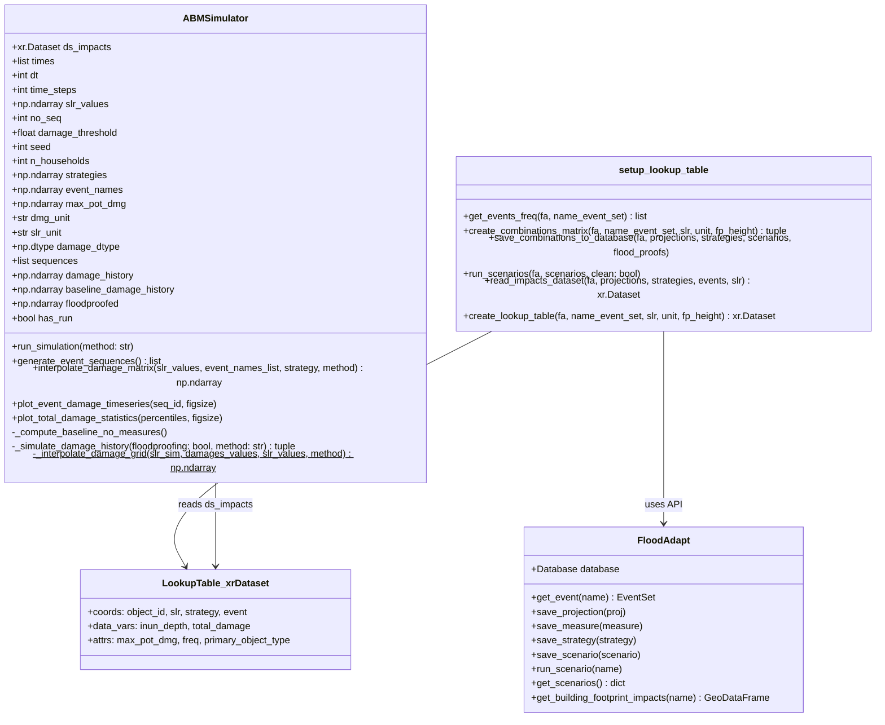
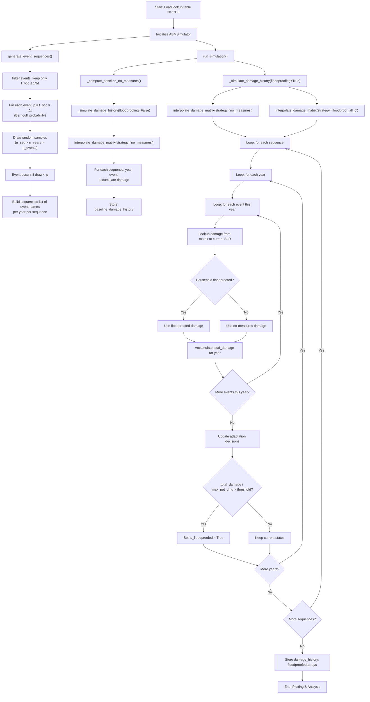
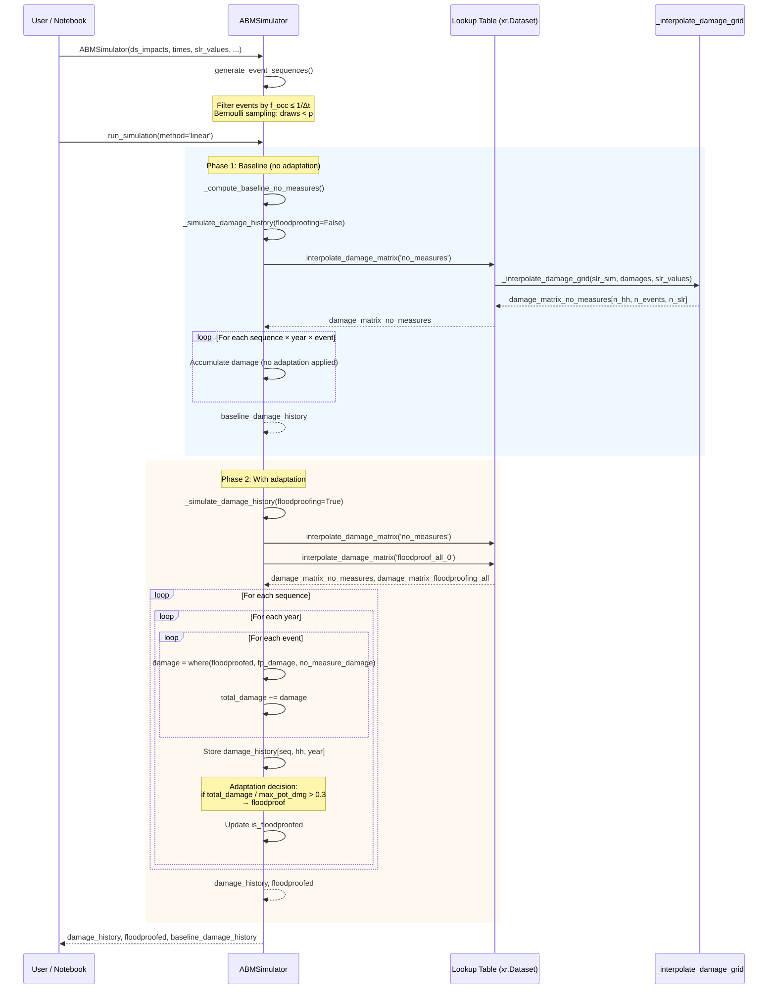

# FloodAdapt-ABM — Complete Technical Documentation

## 1. Purpose & Overview

FloodAdapt-ABM tests how different policy incentives and flood history affect household-level adaptation decisions and long-term flood risk. It couples the FloodAdapt flood-damage model with a simple Agent-Based Model (ABM) simulator that runs Monte Carlo event sequences over a multi-decade time horizon.

The workflow has four main steps:
1. **Set up a lookup table** with FloodAdapt (pre-compute damages for all scenario combinations)
2. **Create multiple plausible event sequences** using Monte Carlo sampling
3. **Evaluate flooding and impacts** for each event in each sequence (including SLR interpolation)
4. **Update household-level adaptation** based on experienced flooding and flood impacts

Steps 3 and 4 repeat for every event in each sequence.

---

## 2. Detailed Steps

### Step 1: Generate Lookup Table (`setup_lookup_table.py`, `1_create_lookup_table.ipynb`)

**Purpose**: Pre-run all possible scenario combinations to make the coupled ABM simulations computationally more efficient.

**User-Defined Inputs**:
| Input | Variable/Argument | Example Value | Description |
|-------|-------------------|---------------|-------------|
| FloodAdapt database path | `DATA_DIR` | `c:\...\Charleston\4_FloodAdapt\Database` | Path to the FloodAdapt database |
| Event set name | `name_event_set` | `"probabilistic_set"` | Name of the probabilistic event set |
| SLR range | `slr` | `np.linspace(0, 2, 5)` = [0, 0.5, 1.0, 1.5, 2.0] ft | Sea Level Rise values covering 30-year projections |
| Unit system | `unit` | `UnitTypesLength.feet` | Length unit for SLR and floodproofing |
| Floodproof height | `fp_height` | `2` (feet) | Building elevation height for the floodproofing strategy |
| SFINCS binary path | `SFINCS_BIN_PATH` | Path to `sfincs.exe` | Hydrodynamic model binary |
| FIAT binary path | `FIAT_BIN_PATH` | Path to `fiat.exe` | Flood impact assessment binary |

**Process** (function `create_lookup_table()`):
1. `create_combinations_matrix()` — Creates all scenario combinations from:
   - **Strategies**: `no_measures` (baseline) and `floodproof_all_0` (elevate all buildings by `fp_height`)
   - **Projections**: One per SLR value, each with `sea_level_rise` set and zero socioeconomic change
   - **Events**: All sub-events extracted from the event set
   - Result: a full factorial of strategies × projections × events → list of `Scenario` objects
2. `save_combinations_to_database()` — Persists projections, measures, strategies, and scenarios to the FloodAdapt database
3. `run_scenarios()` — Runs each scenario through FloodAdapt (SFINCS + FIAT), optionally cleans up non-impact output files
4. `read_impacts_dataset()` — Reads results into an xarray `Dataset` with:
   - **Coordinates**: `object_id` (building IDs), `slr`, `strategy`, `event`
   - **Data variables**: `inun_depth` (inundation depth) and `total_damage` (monetary damage in $)
   - **Attributes**: `max_pot_dmg` (max potential damage per building), `primary_object_type`, `freq` (event frequencies)

**Output**: A NetCDF file (`lookup_table_<site_name>.nc`) containing the complete lookup table.

---

### Step 2: Setup Event Sequences with Monte Carlo (`ABMSimulator.__init__` → `generate_event_sequences()`)

**Purpose**: Generate synthetic multi-year event timelines for probabilistic assessment.

**User-Defined Inputs**:
| Input | Variable | Default/Example | Description |
|-------|----------|-----------------|-------------|
| Time step (Δt) | `dt` (derived from `times`) | 1 year | Temporal resolution |
| Time horizon | `times` | `range(2020, 2051)` → 30 years | Simulation period |
| Number of sequences | `no_seq` | 1000 | Monte Carlo sample count |
| Random seed | `seed` | 42 | Reproducibility seed |

#### Concept — Bernoulli Distribution of Events

Each flood event in FloodAdapt's probabilistic event set has an associated **frequency of occurrence** (f_occ), expressed as the average number of times the event occurs per year (e.g., a 100-year event has f_occ = 0.01/yr).

The key insight is that within any single time step Δt, a given event either **happens** (1) or **does not happen** (0) — this is a classic **Bernoulli trial**. A Bernoulli distribution is the simplest discrete probability distribution: it models a single binary experiment with exactly two outcomes — "success" (event occurs) and "failure" (event does not occur).

##### What is a Bernoulli Distribution?

Named after Swiss mathematician Jacob Bernoulli, the Bernoulli distribution describes a random variable *X* that takes the value 1 with probability *p* and the value 0 with probability *1 − p*. It is the building block of more complex distributions (e.g., a Binomial distribution is the sum of multiple independent Bernoulli trials).

**Probability mass function**:
```
P(X = 1) = p          (event occurs)
P(X = 0) = 1 - p      (event does not occur)
```

**Key properties**:
- Mean: E[X] = p
- Variance: Var(X) = p × (1 - p)
- The distribution is fully determined by a single parameter *p*

##### Formulation in FloodAdapt-ABM

For each event *e* with frequency f_occ,e and time step Δt:

```
X_e ~ Bernoulli(p_e)

where:  p_e = f_occ,e × Δt     (probability of occurrence in one time step)
        1 - p_e                 (probability of non-occurrence)
```

**Example**: A 10-year return period event (f_occ = 0.1/yr) with Δt = 1 year:
- p = 0.1 × 1 = 0.1 (10% chance per year)
- 1 - p = 0.9 (90% chance of NOT occurring)

**Example**: A 100-year return period event (f_occ = 0.01/yr) with Δt = 1 year:
- p = 0.01 × 1 = 0.01 (1% chance per year)
- 1 - p = 0.99 (99% chance of NOT occurring)

##### Why Bernoulli?

This formulation assumes:
- Events are **independent across time steps** (memoryless — last year's flood doesn't affect this year's probability)
- Events are **independent of each other** (e.g., a hurricane and a nor'easter are sampled independently)
- At most **one occurrence** of each event type per time step is expected (valid when f_occ × Δt ≤ 1)

These are standard assumptions in probabilistic flood risk analysis. The Bernoulli approach is computationally efficient and well-suited for generating diverse synthetic event timelines via Monte Carlo sampling.

##### Minor Event Filter

Events with f_occ > 1/Δt are omitted from sampling. With Δt = 1 year, this filters out events that occur more than once per year. The assumption is that minor, very frequent events do not cause significant flooding or damage. If this assumption doesn't hold, the user should choose a smaller time step.

##### Implementation (in `generate_event_sequences()`)
```python
# For each eligible event, compute Bernoulli probability
probs = [freq * dt for freq in event_frequencies if freq <= 1.0 / dt]

# Draw random samples: shape (n_sequences, n_years, n_events)
rng = np.random.default_rng(seed)
draws = rng.random((no_seq, n_years, n_events))

# Event occurs if draw < probability (Bernoulli trial)
occurrences = draws < probs  # Boolean array
```

The result is converted into a list of sequences, where each sequence is a list of years, and each year contains a list of event names that occurred.

**Output**: `self.sequences` — a list of `no_seq` event sequences, each containing `time_steps` years of event lists.

---

### Step 3: Calculate Impacts for Each Event (`_simulate_damage_history()`)

**Purpose**: For every event that occurs in a sequence, look up (via interpolation) the corresponding damage from the lookup table, accounting for the current SLR and adaptation status.

**Process**:
1. Pre-compute two full damage matrices via `interpolate_damage_matrix()`:
   - `damage_matrix_no_measures`: shape `(n_households, n_events, n_time_steps)` — damages WITHOUT adaptation
   - `damage_matrix_floodproofing_all`: shape `(n_households, n_events, n_time_steps)` — damages WITH floodproofing
2. The interpolation uses SLR values at each time step to interpolate between the discrete SLR scenarios in the lookup table
3. Supported interpolation methods: `linear` (default), `nearest`, `cubic`, `floor`, `ceil`
4. For each sequence, for each year, for each event that occurs:
   - Look up damage from `damage_matrix_no_measures` for non-adapted households
   - Look up damage from `damage_matrix_floodproofing_all` for adapted households
   - Combine: `damages = np.where(is_floodproofed, damages_floodproofing, damages_no_measures)`

#### Worked Example — Understanding the Damage Matrices

Consider a small scenario with **3 buildings**, **2 events**, and **3 simulation years** (2020, 2021, 2022) with SLR values [0.0, 0.5, 1.0] ft respectively.

##### What is in the lookup table (raw, before interpolation)

The lookup table (NetCDF) stores damage for every combination of `(building, event, SLR_level, strategy)`. For example, with SLR grid [0.0, 0.5, 1.0, 1.5, 2.0] ft:

```
ds_impacts["total_damage"]  →  shape: (3 buildings, 5 SLR levels, 2 strategies, 2 events)
```

##### What `interpolate_damage_matrix()` produces

The function takes the per-year SLR values `[0.0, 0.5, 1.0]` and interpolates the lookup table along the SLR axis for a given strategy. The result is a 3D array where **each cell answers**: *"If this event hits this building at this year's SLR level, what is the damage?"*

**`damage_matrix_no_measures`** — shape `(3 buildings, 2 events, 3 years)`:

```
                          Year 2020        Year 2021        Year 2022
                         (SLR=0.0ft)      (SLR=0.5ft)      (SLR=1.0ft)
                     ┌─────────────────┬─────────────────┬─────────────────┐
Building 101         │                 │                 │                 │
  Event "hurricane"  │    $12,000      │    $18,000      │    $25,000      │
  Event "nor_easter" │     $3,000      │     $5,000      │     $8,000      │
├────────────────────┼─────────────────┼─────────────────┼─────────────────┤
Building 102         │                 │                 │                 │
  Event "hurricane"  │    $45,000      │    $52,000      │    $60,000      │
  Event "nor_easter" │     $8,000      │    $12,000      │    $18,000      │
├────────────────────┼─────────────────┼─────────────────┼─────────────────┤
Building 103         │                 │                 │                 │
  Event "hurricane"  │         $0      │     $2,000      │     $6,000      │
  Event "nor_easter" │         $0      │         $0      │     $1,000      │
└────────────────────┴─────────────────┴─────────────────┴─────────────────┘
```

Notice that damages **increase across years** because SLR increases → deeper flooding → more damage. Building 103 sits on higher ground so it only gets damaged at higher SLR.

**`damage_matrix_floodproofing_all`** — same shape `(3, 2, 3)`, but with **reduced damages** because buildings are elevated:

```
                          Year 2020        Year 2021        Year 2022
                         (SLR=0.0ft)      (SLR=0.5ft)      (SLR=1.0ft)
                     ┌─────────────────┬─────────────────┬─────────────────┐
Building 101         │                 │                 │                 │
  Event "hurricane"  │     $2,000      │     $5,000      │    $10,000      │
  Event "nor_easter" │         $0      │     $1,000      │     $3,000      │
├────────────────────┼─────────────────┼─────────────────┼─────────────────┤
Building 102         │                 │                 │                 │
  Event "hurricane"  │    $10,000      │    $18,000      │    $28,000      │
  Event "nor_easter" │     $1,000      │     $3,000      │     $7,000      │
├────────────────────┼─────────────────┼─────────────────┼─────────────────┤
Building 103         │                 │                 │                 │
  Event "hurricane"  │         $0      │         $0      │     $1,000      │
  Event "nor_easter" │         $0      │         $0      │         $0      │
└────────────────────┴─────────────────┴─────────────────┴─────────────────┘
```

Damages are lower because the 2ft elevation keeps water out (partially or fully).

##### How these matrices are used during the simulation

Suppose in **Year 2021** (time index `ti=1`) of a Monte Carlo sequence, the Bernoulli draw says **only the "hurricane" event occurred** (nor'easter did not):

```python
year_events = ["hurricane"]       # from sequences[s][1]
event_idx = 0                     # "hurricane" is event index 0
ti = 1                            # year 2021

# Look up the column for this event at this year's SLR:
damages_no_measures = damage_matrix_no_measures[:, event_idx, ti]
#                   = [$18,000,  $52,000,  $2,000]   ← one value per building

damages_floodproofed = damage_matrix_floodproofing_all[:, event_idx, ti]
#                    = [$5,000,  $18,000,  $0]        ← reduced by elevation

# Apply adaptation status (suppose Building 102 is already floodproofed):
is_floodproofed = [False, True, False]

damages = np.where(is_floodproofed, damages_floodproofed, damages_no_measures)
#       = [$18,000,  $18,000,  $2,000]
#           ↑ no adapt  ↑ adapted    ↑ no adapt
#           (full dmg)  (reduced)   (full dmg)

total_damage += damages   # accumulated for this year
```

If **both events** occurred in the same year, both damage columns would be summed:

```python
# Hurricane damage + Nor'easter damage for year 2021:
total_damage = [$18,000 + $5,000,  $18,000 + $3,000,  $2,000 + $0]
             = [$23,000,           $21,000,            $2,000]
```

> **Key insight**: The matrices are pre-computed for ALL events × ALL years, but only the events that actually occur (via the Monte Carlo Bernoulli draw) contribute to a given year's `total_damage`. This is why the lookup table approach is efficient — heavy SFINCS+FIAT computations happen once upfront, and the simulation just indexes into the pre-computed results.

**Output**:
- `damage_history`: array of shape `(n_sequences, n_households, n_years)` — monetary damage per household per year
- `baseline_damage_history`: same shape — damage WITHOUT any adaptation (for comparison)

---

### Step 4: Update Household-Level Adaptation

**Purpose**: After each event, decide which households adopt floodproofing.

**Current Rule** (simple threshold — to be replaced by DYNAMO-M):
```python
# For each household not yet floodproofed:
if (total_damage / max_potential_damage) > damage_threshold:
    is_floodproofed = True
```

**User-Defined Input**:
| Input | Variable | Default | Description |
|-------|----------|---------|-------------|
| Damage threshold | `damage_threshold` | 0.3 (30%) | Fraction of max potential damage that triggers floodproofing |

**Assumed behaviour**: Once a household is floodproofed, it remains floodproofed for all subsequent events (irreversible in current implementation). The household elevation is assumed fixed at the `fp_height` value defined during lookup table creation.

**Output**: `floodproofed` — boolean array of shape `(n_sequences, n_households, n_years)`

---

## 3. Complete Parameter Summary

### User-Defined Inputs
| Parameter | Where Set | Type | Description |
|-----------|-----------|------|-------------|
| SLR range | Notebook 1 | `np.ndarray` (feet) | Sea level rise scenarios for lookup table |
| Floodproof height | Notebook 1 | `float` (feet) | Elevation height for floodproofing strategy |
| Event set name | Notebook 1 | `str` | Name of probabilistic event set in FloodAdapt |
| Time horizon | Notebook 2 | `list[int]` | Years to simulate (e.g., 2020–2050) |
| SLR projection values | Notebook 2 | `np.ndarray` | SLR per year (from FloodAdapt projections) |
| Number of sequences | Notebook 2 | `int` | Monte Carlo sample count (default: 1000) |
| Random seed | Notebook 2 | `int` | Reproducibility (default: 42) |
| Damage threshold | Notebook 2 | `float` | Adaptation trigger (default: 0.3) |
| Interpolation method | Notebook 2 | `str` | Damage interpolation: linear, nearest, cubic, floor, ceil |
| Damage dtype | Notebook 2 | `np.dtype` | Storage precision for damages (default: `np.int32`) |

### Assumed Parameters
| Assumption | Value | Justification |
|------------|-------|---------------|
| Event independence | True | Bernoulli sampling assumes memoryless, independent events |
| Minor event cutoff | f_occ > 1/Δt filtered | Minor events assumed non-damaging |
| Adaptation irreversibility | Once floodproofed, always floodproofed | Simplification; no measure degradation |
| Socioeconomic change | Zero | No population growth or economic change in projections |
| Fixed floodproof height | `fp_height` (e.g., 2 ft) | Same elevation for all buildings |

### Final Outputs
| Output | Shape | Type | Description |
|--------|-------|------|-------------|
| `damage_history` | `(n_seq, n_hh, n_years)` | `np.int32` | Monetary damage per household per year (with adaptation) |
| `baseline_damage_history` | `(n_seq, n_hh, n_years)` | `np.int32` | Monetary damage per household per year (no adaptation) |
| `floodproofed` | `(n_seq, n_hh, n_years)` | `bool` | Floodproofing status per household per year |
| Lookup table NetCDF | — | `xr.Dataset` | Pre-computed damage/depth for all scenario combinations |

---

## 4. UML Class Diagram



---

## 5. Simulation Flowchart



---

## 6. Sequence Diagram — `run_simulation()`



---

## 7. File Reference

| File | Purpose |
|------|---------|
| `setup_lookup_table.py` | Functions to create, run, and read FloodAdapt scenario combinations into a lookup table |
| `abm_simulator.py` | `ABMSimulator` class: Monte Carlo event sequences, damage interpolation, simulation loop, plotting |
| `1_create_lookup_table.ipynb` | Notebook: user-facing interface to create the lookup table for a case study |
| `2_simulate_adaptation.ipynb` | Notebook: user-facing interface to run Monte Carlo simulations with `ABMSimulator` |
| `environment.yml` | Conda environment specification |

---

## 8. How to Use

1. **Install environment**: `conda env create -f environment.yml`
2. **Create lookup table**: Run `1_create_lookup_table.ipynb`
   - Configure paths, event set, SLR range, floodproof height
   - Produces a NetCDF file with the lookup table
3. **Run simulation**: Run `2_simulate_adaptation.ipynb`
   - Load the lookup table NetCDF
   - Set Monte Carlo parameters (sequences, seed, threshold)
   - Uses `ABMSimulator` class from `abm_simulator.py`
   - Uses FloodAdapt only to retrieve SLR projections for the case study

---

*Document generated 2026-06-04. Source: FloodAdapt-ABM repository at `C:\repos\FloodAdapt-ABM`.*
